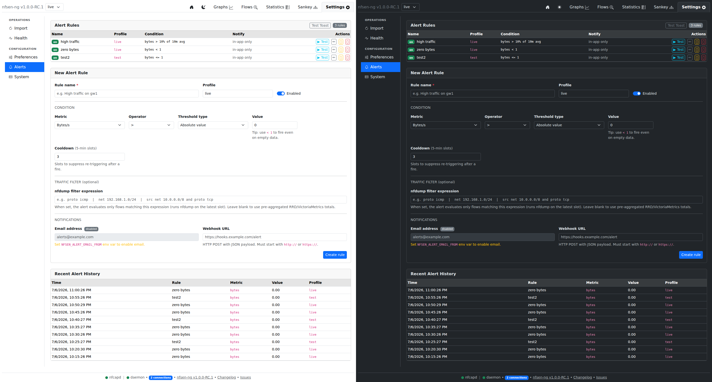

# Alerts

Threshold-based alert rules, evaluated automatically after every nfcapd
import (`Settings → Alerts`). Managed by `AlertManager`
(`backend/common/AlertManager.php`) and `AlertActions.php`.

## Rule shape

| Field | Notes |
|---|---|
| Metric | flows / packets / bytes |
| Operator | `>`, `>=`, `<`, `<=` |
| Threshold type | **Absolute** value, or **percent of a rolling average** window (10m–24h) |
| Cooldown | 5-minute slots to suppress re-firing after a fire |
| Traffic filter | Optional raw nfdump filter expression |
| Notifications | Email and/or webhook (HTTP POST, JSON payload) |

Percent-of-average rules return an unreachable threshold
(`PHP_FLOAT_MAX`) while the rolling average is still zero — a genuine
cold-start guard, not a bug: a rule can't fire against a baseline that
doesn't exist yet.

## Traffic filter

By default a rule's current value comes from the active datasource's
pre-aggregated totals (`fetchLatestSlot()` — cheap, but only ever "all
traffic for this source"). Setting a **traffic filter** — any nfdump filter
expression, e.g. `proto icmp`, `net 192.168.1.0/24`, or a combination —
switches that rule to `AlertManager::fetchCurrentSlot()`, which runs a real
`nfdump` query over the latest 5-minute slot with that filter and sums the
matching flows/packets/bytes instead. This is what lets a rule watch "ICMP
only" or "this one subnet" rather than just aggregate totals.

`fetchCurrentSlot()` is the single source of truth for "should this rule use
the filtered or aggregate path" — both the periodic evaluation loop and the
manual **Test** button call it, so testing a rule and actually evaluating it
behave identically. (They didn't always: see the note in
[Nfdump Integration](../architecture/nfdump-integration.md)'s neighbourhood
about how easy it is for a manual "preview" action to drift from the real
evaluation path if it's implemented as a separate code path instead of a
shared one.)

A malformed filter expression fails safe: `fetchCurrentSlot()` catches the
resulting exception and returns zero values rather than propagating the
error, so a typo in a filter suppresses that rule's firing rather than
crashing evaluation for every other rule.

## Cooldown & history

A fired rule's cooldown ticks down once per evaluation cycle regardless of
whether it fires again; **Recent Alert History** (bottom of the tab) shows
the last 50 dispatches across all rules, newest first.
