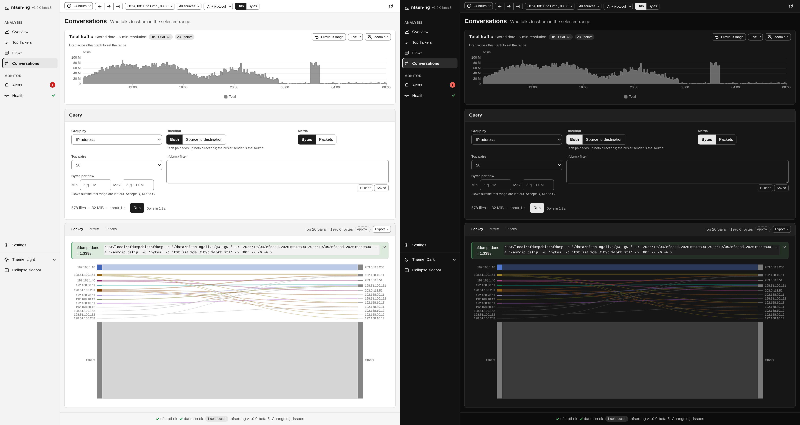
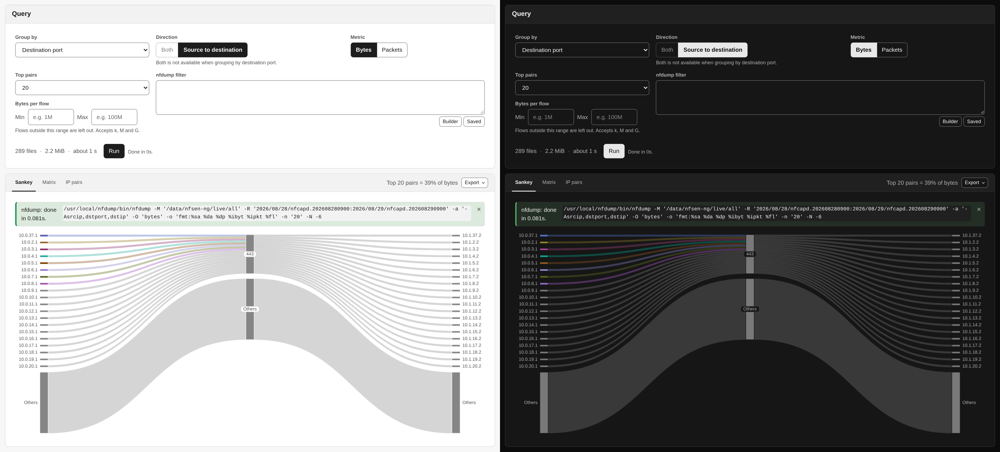

# Conversations

The top source and destination pairs of a window, from one nfdump aggregation,
shown as a Sankey, a Matrix and a ranked table. Page: `ConversationsPage`
(`backend/pages/ConversationsPage.php`), actions in `ConversationActions.php`,
per-tab state in `ConversationsState`.

## Inputs

| Signal | Values | Effect |
|---|---|---|
| `conv_group` | `ip`, `net24`, `net16`, `port` | Group by IP address, /24 or /16 subnet, or IP address through the destination port |
| `conv_direction` | `both`, `forward` | Merge both directions of a pair, or keep source to destination |
| `sankey_metric` | `bytes`, `packets` | Rank and size by |
| `sankey_topN` | 10, 20, 50, 100, 200 | Pairs to show |
| `sankey_filter`, `sankey_lower_limit`, `sankey_upper_limit` | | Filter and byte limits, as on the other query pages |

The window, the sources and the global protocol come from the controls bar.

## The query

`MatrixQuery` (`backend/query/MatrixQuery.php`) runs one nfdump aggregation with
`-A` per grouping:

| Group by | `-A` |
|---|---|
| IP address | `srcip,dstip` |
| /24 subnet | `srcip4/24,dstip4/24` |
| /16 subnet | `srcip4/16,dstip4/16` |
| Destination port | `srcip,dstport,dstip` |

ordered by the metric (`-O`) and limited with `-n`. A subnet grouping adds an
`ipv4` term to the filter, because the masks are IPv4 only, and the page says IPv6
is left out. The window is clamped by `NFSEN_MAX_STATS_WINDOW`.

**Both** is a merge in PHP, not an nfdump option: the query fetches four
times the requested pairs as directed pairs (at most 2000), and
`ConversationPayload::build()` folds `a → b` and `b → a` into one pair oriented
from the heavier sender. Pairs near the end of the list may miss reverse traffic
that fell outside the fetch, so the payload is marked approximate. **Both** is
not available with the port grouping, where a port belongs to one direction; a
request for it falls back to source to destination with a notice.

`conversations-run` (query kind `conversations`) runs the query through
`QueryRunner`. A Kill before nfdump starts, or before the result is stored, keeps
the previous result and its notices. `conversations-check` only recomputes the
server-owned `_conv_stale` flag and reads no capture files; an effect on the query
card's signals posts it, so a filter applied from the drawer marks the result
stale too.

## The payload

`ConversationPayload` (`backend/query/ConversationPayload.php`) turns nfdump's
rows into one JSON payload that all three views read:

- `meta`: metric, grouping, direction, top N, whether it is approximate, and the
  nfdump command.
- `totals`: every flow the filter matched, read from nfdump's summary footer.
- `pairs`: rank, source, destination, port (an int, or ICMP's `type.code` as a
  string), bytes, packets, flows, share of the total, and a series slot for the
  source.
- `others`: the traffic outside the top pairs, when the totals are known.

The payload and the IP pairs table are sent once per result through a
[result host](../architecture/reactive-loop.md#result-hosts).

## Views

- **Sankey** (`nfsen-sankey.js`, ECharts): source, optional port, and destination
  columns, with an **Others** node per column for the traffic outside the top
  pairs. Nodes stay in rank order with Others last. Colour marks the source
  node on this page, which is why the traffic graph above shows one neutral
  total. A click on an address node dispatches `conversation-node`, which opens
  the IP info dialog. ICMP ports are labelled `ICMP type.code`.
- **Matrix** (`nfsen-matrix.js`, ECharts heatmap): sources against destinations,
  coloured with a neutral six-step ramp. A cell outside the ranked pairs is
  hatched: its traffic is unknown, not zero. With **Both**, the mirrored cell of a
  merged pair is left blank rather than hatched.
- **IP pairs**: `Table::generate()` with a rank column, both ends as IP links,
  the port for the port grouping, the figures, and **Share** (`share_pct`), which
  prints as a percentage and exports as the raw fraction with Enhanced data off.
  The Others line sits below the table.

Export offers the pairs as CSV or JSON, a PNG of the open chart, and the nfdump
command.
