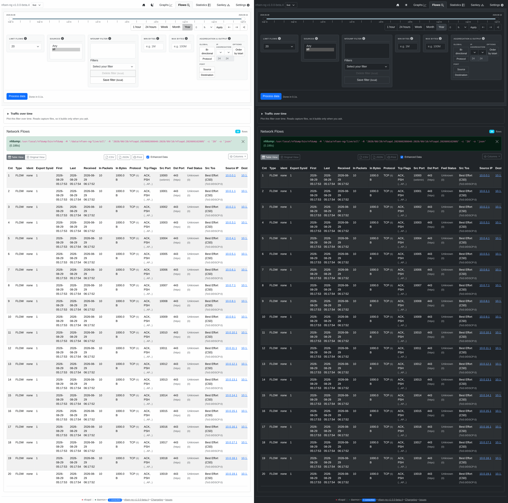

# Flow Browser

Raw flow-record search: runs `nfdump` (see
[Nfdump Integration](../architecture/nfdump-integration.md)) over the
selected date range and renders the matching records as a sortable table.

## Filters

| Control | Effect |
|---|---|
| Limit flows | Cap on returned records |
| Sources | Any / all / a specific source |
| nfdump filter | Raw nfdump filter syntax (e.g. `proto tcp and dst port 443`), free text |
| Min / max bytes | Byte-count bounds |

## Aggregation & output

Optional bidirectional and per-protocol aggregation; port aggregation by
source or destination; IP aggregation with none/exact-IP/IPv4-prefix/
IPv6-prefix granularity per direction; and an "order by tstart" toggle. These
map directly onto nfdump's own `-a`/aggregation flags — the filter panel is
essentially a form over nfdump's CLI surface, not a reimplementation of it.

## IP details

Clicking an IP address cell opens a modal with reverse-DNS plus either
public-IP geolocation or (for private IPs) Netbox data — see
[IP Info Lookup](ip-info.md).

## Traffic over time

**Traffic over time**, the collapsed section above the results table, plots the current flow
query, which
is what [#166](https://github.com/mbolli/nfsen-ng/issues/166) asked for: filter in Flows, then
see *when* those flows happened, without describing the query twice.

The series is built by the same per-bin builder the Graphs tab's filtered mode uses
(`FilteredSeries`), reading the flow filter with its byte thresholds prepended, exactly the
expression the table runs.

Three behaviours worth knowing, all of them deliberate:

- **The row limit and aggregation options do not apply.** Neither changes which records match:
  one truncates the table, the other regroups its rows. So the table can list 100 flows beside
  a graph of every matching byte. The panel says so rather than leaving it to be discovered.
- **It never builds on its own.** Plotting a filter means one nfdump run per interval, so the
  panel states what it would read and waits for **Build graph**. Expanding the section is free.
  It is a disclosure rather than a second button beside **Process data**, which read as a rival
  way to run the query when it only opens a section.
- **A built graph survives a moving window.** The panel renders whatever the last build stored
  and reports that the query has changed, instead of blanking a graph somebody waited for. The
  comparison rounds to the five-minute slot the data uses, so a live window end does not count
  as a change.

A filtered series has no per-port breakdown to draw: the filter *is* the port selection. With
several sources selected the split is per source, otherwise per protocol. The chart carries its
own legend naming each line, since this panel has none of the Graphs tab's external series
controls beside it.
