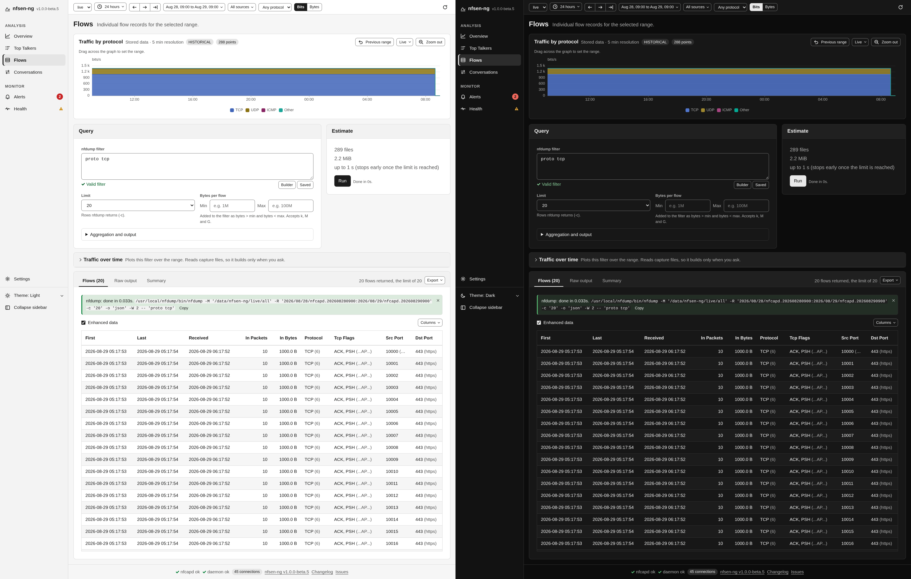
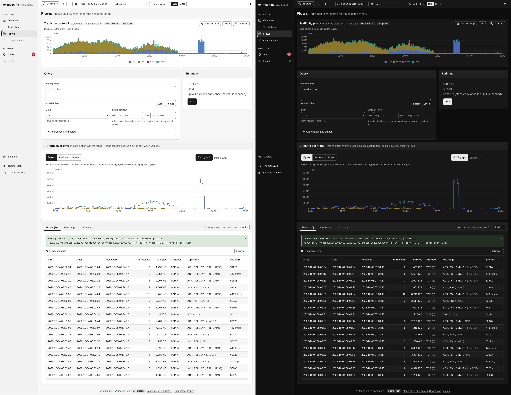

# Flows

Raw flow-record search: `FlowsQuery` runs nfdump (see
[Nfdump Integration](../architecture/nfdump-integration.md)) over the selected
window and the page shows the records as a scrolling list, nfdump's raw output and a
summary. Page: `FlowsPage` (`backend/pages/FlowsPage.php`), actions in
`FlowActions.php` and `FlowGraphActions.php`, per-tab state in `FlowsState`.

## Query inputs

| Signal | Effect |
|---|---|
| `flows_filter` | Raw nfdump filter, validated with `nfdump -Z` while typing (`validate-filter?target=flows`) |
| `flows_limit` | `-c`: 20, 50, 100, 500, 1,000 or 10,000 rows |
| `flows_lower_limit`, `flows_upper_limit` | Byte limits, composed into the filter as `bytes > n` and `bytes < n` |
| `flows_agg_*` | Bidirectional, protocol, source/destination port and per-direction IP aggregation with a prefix, mapped onto `-a`, `-A` and `-B` |
| `flows_orderByTstart` | Sorts the returned rows by start time |

The window, the sources and the global protocol come from the controls bar.
`FilterComposer` parenthesises the user filter, the protocol term and the byte
limits and joins them with `and`, so an `or` in the filter cannot escape the byte
limits. A filter starting with `-` never reaches nfdump's option parser: the
command passes `--` before it.

## Estimate and run

The estimate card (`estimate-query?target=flows`) shows the files, bytes and
seconds of the window before anything runs. Flows is the one kind whose time is an
upper bound: nfdump stops once it has the rows `-c` asks for, and the estimate
says *stops early once the limit is reached*. Flows is not clamped by
`NFSEN_MAX_STATS_WINDOW`, since the limit already bounds it.

`flow-actions` (query kind `flows`) runs `-o json -c <limit>` through
`QueryRunner`, with progress from the bytes nfdump has read and a Kill. Listings
above 1,000 rows run one at a time per worker, after checking that the worker has
the memory to parse them, so two 10,000-row runs cannot exhaust it together.

## The list

The Flows tab is one list of every returned row: Starbase's `sb-virtual-scroll`
(`#flowRows-<result>`, `role="table"`), which keeps only the rows around the view
in the document. The server keeps the result's rows per result id in
`FlowRowStore` (`backend/pages/state/FlowRowStore.php`): blocks of 64 rows of
rendered cells, compressed, with each column's raw values and sort keys, under
the same 12 MiB budget as the other stored results. The first 160 rows come with
the page; scrolling asks for windows of at most 500 rows with `flows-window`, and
each answer patches the list by its id. These requests post only `via_ctx`: the
sort, the hidden columns, the zone and the rows all come from the tab's state on
the server (`FlowsState`), so a window costs a few hundred bytes up and the rows
it holds down. Rows are 38 px high, 30 px with compact tables, and the header
stays on top while the rows scroll.

A header button sorts by its column (`flows-sort`), stable against the order before
and with empty values last, and the list starts again from the top. The Columns
picker next to the list hides columns (`flows-columns`, the whole hidden set each
time). Both choices live in the tab's state and are remembered per browser, so the
next Run starts with them. Tab and Shift+Tab walk the rows one at a time across
windows: the list puts the focus back on the same row when a window refills the
element that had it.

Export (CSV, JSON) and Print are built on the server from the stored rows, in the
list's order and with its shown columns (`flows-export`), and the page pulls the
file in 512 KiB pieces (`flows-export-chunk`) before it saves or prints it. The
Enhanced data switch chooses the text the list shows or the raw values. Print
renders every row in a frame on the page and opens the browser's print dialog.

Times are written in the browser's time zone, which the Run sends, or in the
capture's zone when Settings show server time; a zone saved in Settings applies to
the next window. Compact tables saved in Settings apply from the next Run. When the
server has dropped the rows to make room for other results, the tab says so and
asks for a new Run.

Clicking an IP address opens the [IP info](ip-info.md) dialog.

## Raw output

The Raw output tab is nfdump's stdout, untouched on every path, with the command
line (`Nfdump::execute()` returns a clean `command` and the `notes` nfdump printed
beside the data). It is sent in 512 KiB chunks through `flows-raw`, and the page
keeps the first 5 MiB of a larger output. Copy and Download wait for the chunks.

## Summary

A `-o json` run prints no summary footer, so the Summary tab is built from three
sources:

- **Returned rows**: flows, packets, bytes, first and last seen, duration and
  averages, computed in PHP from the rows (`FlowsQuery::returnedSummary()`),
  labelled as limited by the row limit when it was reached.
- **Range totals**: `TotalsProvider::fetchProtocolTotals()` of the datasource, the
  unfiltered stored totals of the window per protocol. They are read right after
  the table is sent, from the stored series only.
- **Filtered totals**: `flows-summary-run` (query kind `flows-summary`) runs
  `-o csv -n 0 -s proto/bytes` with the full composed filter, without the row
  limit or aggregation, and sums the protocol rows. It has its own estimate
  (`flows-summary-estimate`) and runs only on **Compute filtered totals**.

## Traffic over time

The folded **Traffic over time** section plots the current flow query over the
window, which is what [#166](https://github.com/mbolli/nfsen-ng/issues/166) asked
for: filter in Flows, then see *when* those flows happened.

The series is built by the same per-bin builder as Overview's filtered mode
(`FilteredSeries`), reading the flow filter with its byte limits, exactly the
expression the table runs. `build-flows-graph` (query kind `flowsgraph`) builds
it; `touch-flows-graph` re-renders after a client-side change (the plotted unit)
and reads nothing.

- **The row limit and aggregation options do not apply.** Neither changes which
  records match: one truncates the table, the other regroups its rows. The
  section says so.
- **It never builds on its own.** Plotting a filter means one nfdump run per
  interval, so the section states what it would read (*in 145 nfdump runs*) and
  waits for **Build graph**. The runs go side by side, one per free nfdump
  process, and **Kill** stops them all and keeps the intervals that finished.
  The window is clamped by `NFSEN_MAX_STATS_WINDOW`.
- **A built graph survives a moving window.** The section renders the last build
  and reports that the query changed, instead of blanking a graph somebody waited
  for. The comparison rounds to the five-minute slot, so a live window end does
  not count as a change.

A filtered series has no per-port breakdown: the filter *is* the port selection.
With several sources selected the split is per source, otherwise per protocol.
The chart carries its own legend, since the section has no series panel. Its
unit and the display timezone of its labels come from `data-chart-config`, which
the page sets from client signals and lists in the host's `data-preserve-attr`,
so a server update does not reset them.
