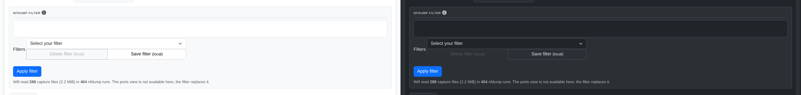
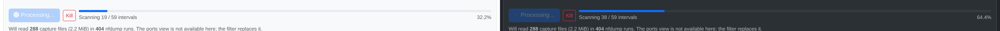

# Traffic Graphs

The default landing tab: time-series traffic graphs rendered with
[Apache ECharts](https://echarts.apache.org/), driven by the shared date-range
control (top of every data tab) and a filter panel.

## Filters

| Control | Effect |
|---|---|
| Source data | **Stored** (the aggregated database series) or **Filtered** (re-read the captures through an nfdump filter) |
| Display | Group series by **Sources**, **Protocols**, or **Ports** |
| Sources | Any configured source, `all`, or a specific subset |
| Protocols | Any / TCP / UDP / ICMP / Others |
| Data type | Traffic / Packets / Flows |
| Unit | Bits or Bytes |

Data comes from `Datasource::get_graph_data()` — RRD or VictoriaMetrics,
whichever is configured (see [Data Sources](../architecture/data-sources.md)).
The graph re-renders live: every nfcapd import broadcasts `rrd:live` to every
open tab (see [Import Pipeline](../architecture/import-pipeline.md)), so the
"LIVE last update" badge and the plotted series update without a manual
refresh.

## Filtered mode

The datasources store flows/packets/bytes aggregated per 5-minute slot, with no
record-level detail left, so an nfdump filter cannot be applied to them after the
fact. **Filtered** mode answers the question a different way: it goes back to the
nfcapd files and runs one `nfdump -s proto` per time bin, assembling the same
series shape the datasources return.

Switching **Source data** to **Filtered** reveals the filter box — same syntax as
the [Flow Browser](flows.md), same saved presets — plus the **Apply filter**
button that is the only thing that ever starts a build:

This is the same mechanism the per-port graphs have always used — the import
writes a per-port RRD by running nfdump over each capture with `dst port N` —
generalised to any filter expression.

What that costs, and why the mode behaves differently from **Stored**:

- The number of nfdump invocations is bounded by the requested resolution, not by
  the width of the window; the bytes read off disk are the same bytes the
  [Flow Browser](flows.md) already reads for the same range.
- It never runs by itself. There is no live tick and no refresh on a filter
  change — only the explicit **Apply filter** button. The result is cached, so
  re-rendering the page (which happens on every SSE push) costs nothing.
- Progress is reported exactly, as intervals scanned, and **Kill** stops the run
  between bins while keeping whatever was already scanned:

  

- The **Ports** display is not available; the filter replaces it. The **Protocols**
  buttons work as they do in Stored mode — on the protocols display they choose which
  series exist, on the sources display they narrow what each source series counts.
- The window is capped by `NFSEN_MAX_STATS_WINDOW`, the same setting that bounds
  Statistics and Sankey, and the panel states what a build will read before you start it.

A built series looks like any other graph, minus the live/historical badge — a
**FILTERED** badge takes its place, since the series is a one-off build rather
than something that keeps up with the capture:

**Stored** is the default and is unchanged: live, instant, auto-refreshing.

The [Investigate](../guide/quick-tour.md#the-investigate-tab) view pairs this graph with the flow
table so the same filter can be read as a timeline and as records at once.

## Resolution & display controls

Below the chart: a data-points slider (points to render, trading resolution
for render cost), linear/logarithmic scale, stacked/line series display, and
step/curve plot style — all client-side ECharts options, no server
round-trip.
