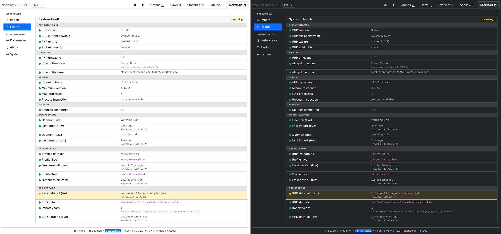
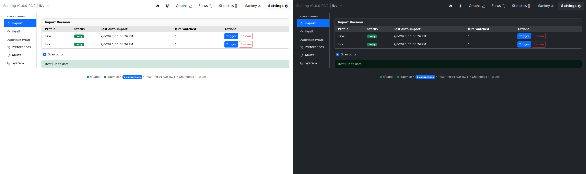

# Health Checks & Admin

Two adjacent Settings sub-tabs cover operations: **Import** (manual scan
controls + daemon status) and **Health** (a structured environment/config
audit). Both are populated by `HealthChecker::run()`
(`backend/common/HealthChecker.php`), re-run on every view render with a
30-second throttle.

## Health check groups

| Group | Covers |
|---|---|
| PHP Extensions | PHP version, `ext-openswoole`, `ext-rrd` (only required for the RRD datasource), `ext-inotify` |
| Timezone | PHP timezone, `NFCAPD_TZ` validity, and a plausibility check comparing the most recent nfcapd filename's timestamp against "now" |
| nfdump | Binary presence/version (minimum 1.7.2 — the JSON field-name scheme changed from 1.6.x), max-processes config, and **process inspection** (below) |
| Sources | At least one configured |
| Import Daemon | Running / initializing / watching N directories, last auto-import age |
| nfcapd Paths | `profiles-data` reachable; per-profile, per-source directory presence, flat-vs-nested layout, and capture freshness (warns past ~12 minutes — 2.4× nfcapd's default 5-minute rotation) |
| RRD Storage / VictoriaMetrics | Delegated to the active `Datasource::healthChecks()` |

Every entry is `ok` / `warning` / `error`, sorted errors-first within its
group, with an optional hint line explaining what to actually do about it.

## Process inspection

`Misc::countProcessesByName()` — the function backing the nfdump
concurrency guard (see [Nfdump Integration](../architecture/nfdump-integration.md)) —
needs `ps` or `pgrep` on `PATH`. Without either, it silently returns `0`,
which makes the guard permanently believe no nfdump process is running. The
**Process inspection** health entry exists specifically to surface that
condition as a `warning` rather than let it look like a healthy, quiet
system.

## Import (Admin)

**Trigger import** re-runs the catch-up scan for the selected profile;
**Force rescan** additionally resets the datasource for that profile first
(a destructive re-import, guarded by a confirmation signal). Both lock the
profile's `ImportDaemon` for the duration so the ongoing inotify poll
doesn't advance the datasource ahead of where the manual scan has reached.
