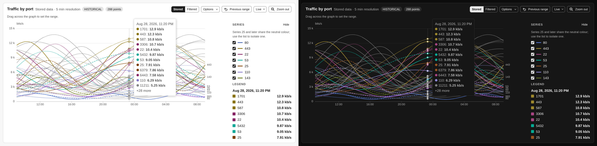
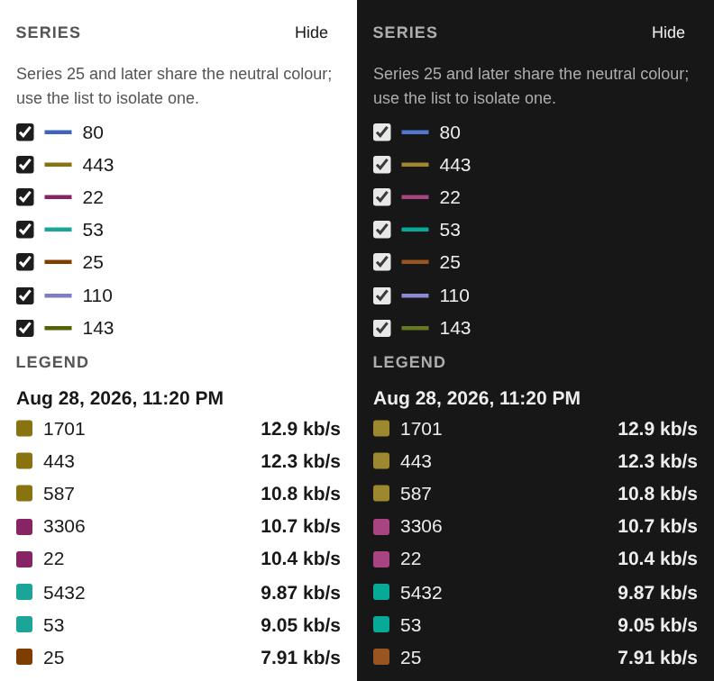

# Overview and the Traffic Graph

The Overview page is the traffic graph plus two things read from SQLite: the KPI
strip and the top-N card. The graph itself is a shell module that every analysis
page shares.

## The persistent traffic graph

`TrafficGraph` (`backend/pages/TrafficGraph.php`) is a shell module, rendered by
`shell/traffic-graph.html.twig` above the page content. There is one
`<nfsen-chart id="trafficGraph">` for the whole app; it stays in the DOM when you
switch pages, so the chart does not rebuild. `nfsen-chart` is a Rocket element:
its shadow root holds only a `<slot>`, the chart container stays in the light DOM
as `data-ignore-morph data-ignore`, and its ECharts instance, zoom and brush live
in `nfsen/host-state`, so a morph that moves the element keeps them. The Flows
*Traffic over time* chart is a second `nfsen-chart`. `TrafficGraph::mode()` decides what
it plots:

| Mode | Page | Series |
|---|---|---|
| `overview` | Overview | The Overview configuration: by source, protocol or port, one data type, stored or filtered |
| `picker` | Top Talkers, Flows | *Traffic by protocol*: stored, stacked by protocol, summed over the selected sources, 300 points |
| `picker-total` | Conversations | *Total traffic*: one neutral series, because colour there means "source node" |
| `none` | Alerts, Health, Settings | Hidden, no data fetched, ignored by morphs |

The data comes from `Datasource::get_graph_data()`, RRD or VictoriaMetrics (see
[Data Sources](../architecture/data-sources.md)). The graph is fetched in the
render when it is due: after a range or option change, on the live tick (every
15 s on Overview, every 60 s on the other analysis pages, both only while
`range_live` is true and the graph shows stored data), and after an `rrd:live`
broadcast from the import. During an import a tab fetches at most every 10
seconds (`ShellState::IMPORT_THROTTLE`).

The header line comes from `TrafficGraph::modeLabel()`: *Stored data · 5 min
resolution*, *Filtered data · 30 min bins*, or *Filtered data · press Apply
filter*.

### Selecting a range

The chart emits `range-select` when a brush drag ends, and the section posts
`set-range?op=abs&from=&to=`. A plain wheel scrolls the page; Ctrl + wheel zooms
the chart locally and emits `graph-zoom`, which the header shows as *Previewing …*
with Apply and Reset (or applies at once with **Follow graph zoom**). On a coarse
pointer the brush is armed only by **Select range**. **Previous range** restores
the client-local `$_prevRange` that every range change writes first. None of this
reads a capture file: every range operation ends in a render that reads stored
series.

## Filtered mode

The datasources store flows, packets and bytes per five-minute slot, with no
record-level detail left, so a filter cannot be applied to them after the fact.
**Filtered** mode goes back to the nfcapd files: `FilteredSeries`
(`backend/processor/FilteredSeries.php`) runs one `nfdump -s proto` per time bin
and assembles the same series shape the datasources return.

- It runs only from the `run-filtered-graph` action (**Apply filter**), with
  query kind `graph`. There is no live tick and no refresh on a filter change.
  The result is kept in `FilteredGraphCache`, so the renders that follow cost
  nothing.
- The number of nfdump runs is bounded by the resolution, not by the width of
  the window. The bins run side by side, one per free nfdump process, and give a
  process back after each bin to a user query that waits (see
  [Nfdump Integration](../architecture/nfdump-integration.md#filtered-graphs-in-parallel)).
  Progress is exact (bins done out of bins). Kill stops every bin in flight at
  once and keeps the bins that finished; the cancelled ones stay out of the
  series.
- The window is clamped by `NFSEN_MAX_STATS_WINDOW`, and the estimate
  (`estimate-query?target=overview`) says what a build will read.
- The Ports display is disabled; the filter replaces it. The global protocol
  becomes a parenthesised term in front of the filter on the Sources display.

The per-port graphs work the same way at import time (each capture file queried
with `port N`); filtered mode generalises that to any expression. The Flows page
uses the same builder for its Traffic over time section (see
[Flows](flows.md)).

## KPI strip

*Total traffic* comes from `TotalsProvider::fetchTotals()` of the datasource
(RRD caches whole-day sums per file, so a long window is not a long `rrd_fetch`),
read together with the graph data and kept in the tab's graph cache. The other
three cards (top source, top destination, top protocol) come from the same stored
answer as the top-N card below. While the stored lists do not cover the range, or
collection is off, the cards say so instead of showing a figure.

## Precomputed top-N

The top-N card never runs nfdump for a range inside retention. Three pieces
produce its answer:

- **`TopNCollector`** (`backend/common/TopNCollector.php`) is fed by the import
  (see [Import Pipeline](../architecture/import-pipeline.md#top-n-collection)).
  For every capture file it runs nfdump twice (nfdump takes at most eight `-s`
  per run) for nine statistics: source and destination IP, source and
  destination port, protocol, source and destination AS, input and output
  interface. It stores the top 50 by bytes per statistic and source.
- **`TopNRepository`** (`backend/store/TopNRepository.php`) writes those rows to
  `topn_5m` and keeps exact hourly and daily sums of them in `topn_1h` and
  `topn_1d`, so every range answer equals summing the five-minute rows grouped
  by key. An interval is stored with a pending mark, and the collector adds the
  marked intervals to the sums every 48 intervals; until then a range read takes
  the marked intervals from `topn_5m`. The only truncation is the per-interval
  top 50. See [SQLite store](sqlite-store.md) for the schema.
- **`TopNQuery`** (`backend/query/TopNQuery.php`) answers a range: the window is
  rounded down to five minutes and read as `[start, end)`, split into segments
  (five-minute rows for ranges up to six hours and the ragged edges, whole hours
  in six-hour chunks, whole UTC days one by one), each a single primary-key range.

The `overview-topn` action computes the KPI and table answers in a coroutine that
yields between chunks, never in a render, and stores them in `OverviewState`;
the page posts it from an effect keyed on the window rounded to five minutes, so
a live window asks at most once per interval. Range results are cached in a
64-entry LRU for 300 seconds, invalidated when the profile's collector
generation moves (after a batch of new intervals is written).

The card labels the lists *approx. from per-interval top 50*, ranks them by
bytes (ordering by packets or flows says *ranked by bytes per interval*), notes a
coverage below 95 %, and says that the global protocol does not apply to them.
For windows up to six hours the rows also carry how many intervals each key was
in the top 50.

### Out of retention

When the window starts before the retention (`NFSEN_TOPN_RETENTION_DAYS`,
default 31), when collection is off, or when the store is unavailable, the card
offers `overview-topn-run` (query kind `overview-topn`): the same statistic from
nfdump with `-o csv`, over the capture files that still exist. Its share column is
nfdump's own `bytP` for that run, so rows and denominator come from the same
files; the stored series usually outlive the captures, and a stored total would
not match.

## Colours

Series colours come from `theme-colors.js` in fixed slots: sources and ports in
their configured order, protocols as TCP 1, UDP 2, ICMP 3 and Other 4. There are
eight slot colours. In a line chart with more series they repeat, dashed for
series 9 to 16 and dotted for 17 to 24; from the 25th on, series are thin neutral
lines. A rank chip in the top-N table takes a slot colour only when its row is a
series of the graph above (protocol rows under the Protocols display, drawn ports
under the Ports display).

## Reading a graph with many series

The **Ports** display draws one line per configured port, and a real port list
runs to dozens. Three things keep that readable:

- **Hovering a line lifts it and fades the rest**, the reliable way to identify
  one: the palette runs out long before sixty series.

- **The tooltip and the Legend list show the largest series first**, capped, with
  a count of the rest.
- **The Series list carries a colour swatch per entry** and scrolls rather than
  growing, so it cannot push the chart off the screen.

## Display controls

Scale, style and line (linear or log, stacked or line, step or curve) are
client-local signals (`$_graph_logscale`, `$_graph_stacked`, `$_graph_stepplot`),
persisted per browser and applied by ECharts without a server round trip. Display
by, data type, ports and resolution are tab signals; changing them posts
`refresh-graphs`.
