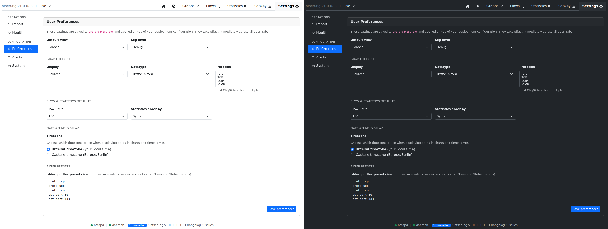
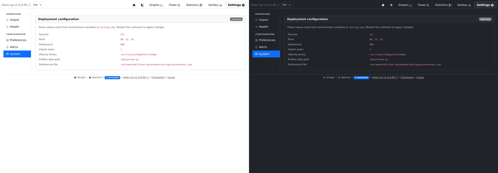

# Preferences & Timezones

Two more Settings sub-tabs: **Preferences** (user-editable, persisted to
`backend/settings/preferences.json`) and **System** (a read-only dump of
deployment config for reference).

## Preferences

| Section | Fields |
|---|---|
| General | Default view (which tab opens on load), log level |
| Graph defaults | Default display mode, datatype, protocols |
| Flow & statistics defaults | Default flow limit, default statistics order-by |
| Date & time display | Browser-local vs. server timezone for displayed timestamps |
| Filter presets | A saved list of nfdump filter strings, offered as quick picks across Flows/Statistics/Sankey |

Saving persists through `SettingsActions::register()`'s single `save-settings`
action, which merges the new values with whatever's already in
`preferences.json` — including the alert rules, so saving preferences never
touches alert state.

> **How this layers with env vars / `settings.php`.** Configuration is applied in
> two stages: the deployment baseline (environment variables, then the deprecated
> `settings.php` overlay) is built first, and `preferences.json` is overlaid on
> top. For the fields the Preferences tab owns — default view, graph/flow/stats
> defaults, filter presets, display timezone, and **log level** — the saved
> preference therefore **wins over the deployment value**. In particular a saved
> `logPriority` overrides `NFSEN_LOG_LEVEL`; if you set the log level by env var,
> either leave the Preferences log level unset or match it there. Everything
> outside that list (sources, ports, datasource, nfdump paths, import depth,
> NetBox, theme) comes only from the deployment layer and is shown read-only on
> the **System** sub-tab.

### Timezones

The container itself runs `TZ=UTC`; nfcapd filenames are parsed in
`NFCAPD_TZ` if set (falls back to the PHP timezone otherwise), independent
of the browser display setting above. If nfcapd runs in a different
timezone than the container, set `NFCAPD_TZ` explicitly — the Health
sub-tab's "nfcapd file time" check will flag an implausible (future or very
stale) timestamp if this is wrong.

## System

Read-only: sources, ports, active datasource, import-years, nfdump binary
path, profiles-data path, and the preferences file location — everything
that comes from environment variables or `settings.php` and needs a
container restart to change. Useful as a "what is this instance actually
configured with" reference without grepping env vars.
