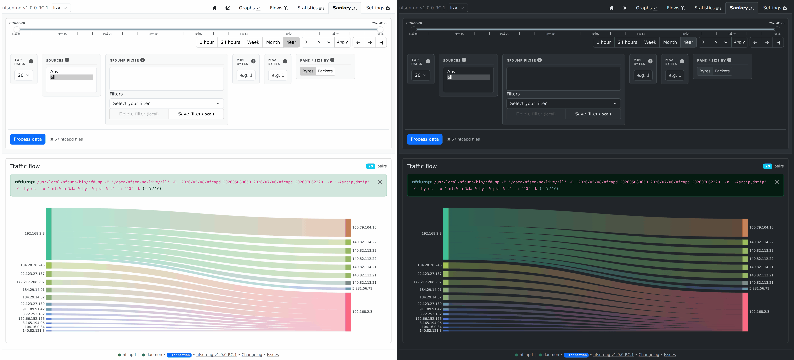
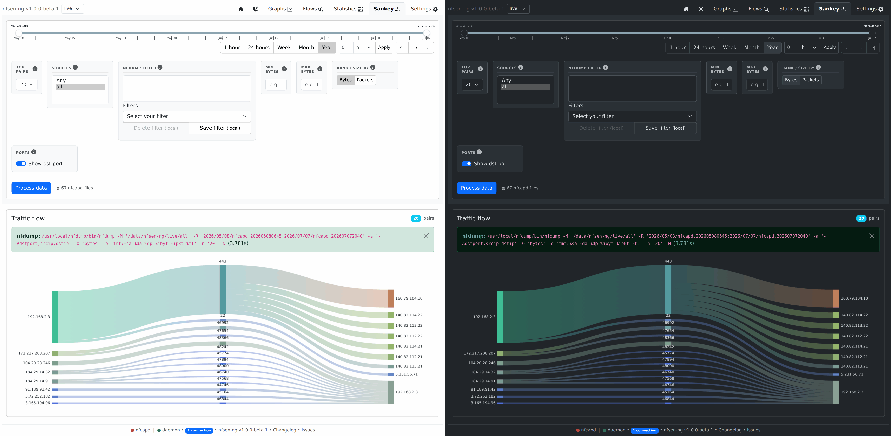

# Sankey Diagram

A flow-volume Sankey diagram (source → destination, ranked by bytes or
packets) rendered with [ECharts](https://echarts.apache.org/), backed by a
new nfdump aggregation query (`SankeyActions.php`) rather than reusing the
Flows/Statistics query shapes.

## Filters

Same shape as [Statistics](statistics.md) — date range, sources, nfdump
filter, min/max bytes — plus:

| Control | Effect |
|---|---|
| Top pairs | How many src→dst pairs to render |
| Rank / size by | Bytes or packets |
| Ports | Add the destination L4 port as a middle column (src IP → dst port → dst IP) |

With **Ports** on, the aggregation key gains the destination port
(`-A srcip,dstport,dstip`) and the payload becomes three columns: the middle
`port:` nodes carry a per-port total, so all traffic src→port and port→dst is
summed into shared ribbons.

