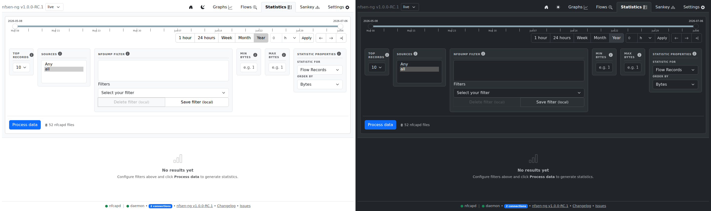

# Statistics

Top-N breakdowns — nfdump's `-s` statistics mode — over any of the
dimensions nfdump itself supports: flow records, any/src/dst IP, any/src/dst
port, interfaces, AS numbers, next-hop IP, router IP, protocol, direction, or
TOS byte.

## Filters

Shares the same date-range, source, nfdump-filter, and min/max-bytes
controls as [Flows](flows.md), plus:

| Control | Effect |
|---|---|
| Top records | How many ranked rows to return |
| Statistic for | Which dimension to rank by (see the list above) |

Each row links its IP-shaped values into the same
[IP Info Lookup](ip-info.md) modal as the Flows tab.
