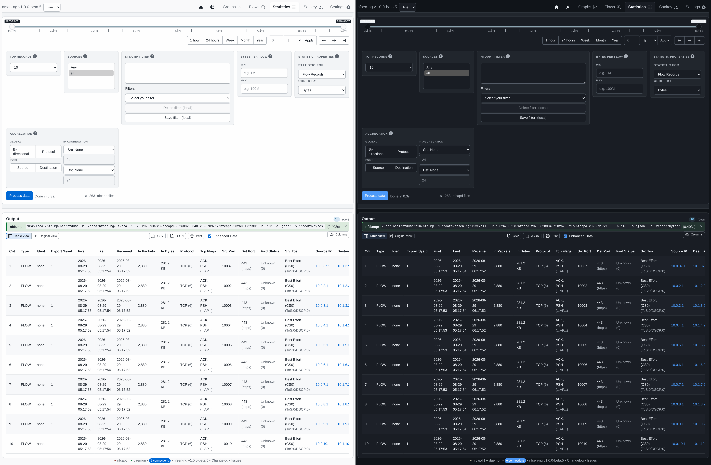

# Statistics

Top-N breakdowns — nfdump's `-s` statistics mode — over any of the
dimensions nfdump itself supports: flow records, any/src/dst IP, any/src/dst
port, interfaces, AS numbers, next-hop IP, router IP, protocol, direction, or
TOS byte.

## Filters

Shares the same date-range, source, nfdump-filter, and min/max-bytes
controls as [Flows](flows.md), plus:

| Control | Effect |
|---|---|
| Top records | How many ranked rows to return |
| Statistic for | Which dimension to rank by (see the list above) |
| Aggregation | What counts as one record, for **Flow Records** only (see below) |

Each row links its IP-shaped values into the same
[IP Info Lookup](ip-info.md) modal as the Flows tab.

## Aggregation

**Flow Records** ranks whole flows rather than one element of them, so what counts as *one*
flow is a question only you can answer: every distinct 5-tuple, everything to the same port,
or everything between two /24s. The **Aggregation** controls answer it, and they are the same
ones the [Flows](flows.md) tab uses — bidirectional, protocol, source/destination port, and
per-direction IP with an optional prefix length — mapping onto nfdump's `-A`.

They appear for **Flow Records** only, because nfdump applies an aggregation to that statistic
alone. Every other statistic already aggregates by its own element, and answers a spec with
`Warning: Aggregation ignored for element statistics`.

Two consequences are visible in the result:

- **The columns change with the aggregation.** Aggregating by destination port yields a table
  of ports, not of 5-tuples, because the fields you did not aggregate on no longer identify a
  row. nfdump chooses the column set, not nfsen-ng.
- **Bi-directional output is a text block rather than a table.** nfdump prints its
  merged-flow format as fixed-width text whatever output format it is asked for, so it is
  shown as-is instead of being parsed into columns — the same as on the Flows tab.
