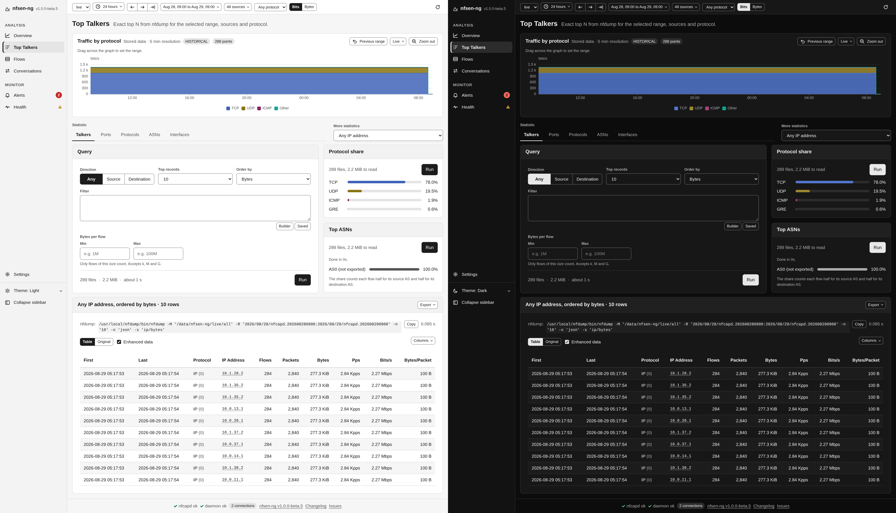
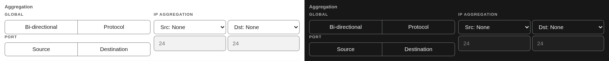
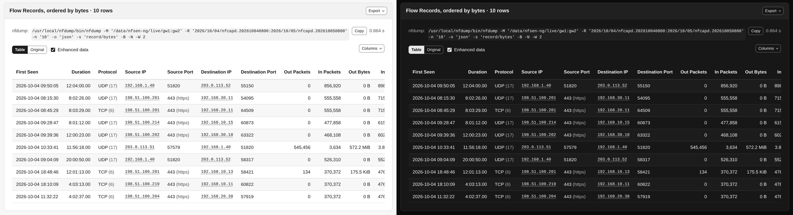

# Top Talkers

Top-N breakdowns with nfdump's `-s` statistics mode, over any element nfdump
supports, plus two side panels for the protocol split and the busiest autonomous
systems. Page: `TalkersPage` (`backend/pages/TalkersPage.php`), actions in
`StatsActions.php`, per-tab state in `TalkersState`.

## The statistic catalog

`StatisticCatalog` (`backend/query/StatisticCatalog.php`) is the one list of the
58 statistic elements the page offers, each with its label and its group in the
**More statistics** select. It also defines:

- `TABS`: the five common statistics as families with a direction (`talkers` is
  `ip`, `srcip` or `dstip`; `ports` is `port`, `srcport` or `dstport`; `protocols`
  is `proto` only; `asns` and `interfaces` likewise). The page's `stats_dir`
  signal (`any`, `src`, `dst`) picks the member.
- `FAMILIES`: the same pairing for ToS, masks, VLAN and the NAT address and port
  elements, so the Direction control works for them too.
- `ORDER_BY`: `flows`, `packets`, `bytes`, `pps`, `bps`, `bpp`. `stats_orderBy` is
  checked against it before it reaches `-s <element>/<order>`, as `stats_for` is
  checked against the catalog.
- `unsupported()`: the NEL elements (`nevent`, `nsrcip`, `ndstip`, `nsrcport`,
  `ndstport`) probed once per nfdump binary with `nfdump -Z '' -s <element>/bytes`.
  nfdump 1.7.8 exits 1 with *Unknown statistic*, and the select shows those
  options disabled with that reason. `TalkersPage` caches the answer for 60
  seconds per binary.

Choosing a statistic changes signals only. `talkers-select` re-renders so a
statistic that ran earlier in this tab shows its stored result; nothing runs.

## Running a statistic

`stats-actions` (query kind `stats`) builds a `StatsQuery`
(`backend/query/StatsQuery.php`): `-M` with the global sources, `-R` for the
window, `-n` for Top records, `-s <element>/<order>`, the byte limits and the
global protocol composed into the filter by `FilterComposer`, and the window
clamped by `NFSEN_MAX_STATS_WINDOW`. It runs through `QueryRunner` with progress
and Kill, and its estimate is `estimate-query?target=talkers`. The
server-owned `_stats_rows` signal carries the row count of the stored result,
shown as "N rows returned" when the run finishes.

The result is stored per statistic in `TalkersState`, with a fingerprint of its
inputs. The window part of the fingerprint is `live:<width>` while the range is
live, so a live result does not turn stale by itself; after five minutes the card
says which span it covers instead. The table is sent once through a result host
(see [Reactive Loop](../architecture/reactive-loop.md#result-hosts)). Clamp
notices and nfdump's stderr lines are kept with the result they belong to, and a
cancelled run keeps the statistic's earlier result.

Each row links its IP-shaped values to the [IP info lookup](ip-info.md). The
table is `nfsen-table` with sorting, the Columns menu, CSV/JSON/Print export and
the Enhanced data switch, as on [Flows](flows.md#the-table).

## Side panels

`talkers-panel?panel=proto|as` (query kind `talkers-panel`) runs `-o csv -n 10
-s proto/bytes` or `-s as/bytes` with the query card's filter, byte limits,
window, sources and protocol. `MultiStatCsvParser` reads the csv, and the panel
stores its bars with the inputs they were computed for, so it can say when the
query card has moved on.

- **Protocol share** colours its bars with the protocol series slots of the
  traffic graph (TCP 1, UDP 2, ICMP 3, Other 4).
- **Top ASNs** comes from nfdump's `as` statistic, which counts a flow for both of
  its ends. The bar length halves that (each flow counts half for its source AS
  and half for its destination AS) so the shares add up; the hover shows nfdump's
  byte figure for the AS.

## Aggregation

**Flow Records** ranks whole flows rather than one element of them, so what counts
as *one* flow is a question only the user can answer. The aggregation controls
are the same partial the [Flows](flows.md) page uses (bidirectional, protocol,
source and destination port, per-direction IP with an optional prefix length),
mapping onto nfdump's `-A`, or `-B` for bidirectional.

They appear for **Flow Records** only, because nfdump applies an aggregation to
that statistic alone and answers every other one with `Warning: Aggregation
ignored for element statistics`. nfdump chooses the column set: aggregating by
destination port yields a table of ports, not of 5-tuples.

**Bi-directional** is the one query whose output format nfdump chooses for itself:
it prints its merged-flow table as fixed-width text whatever `-o` it is given.
nfsen-ng reads that table back into columns, so it behaves like any other result
(IP lookups, formatted byte counts, CSV/JSON export), with nfdump's text one click
away under **Original**.

