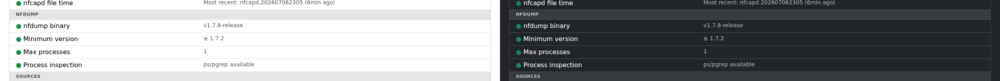

# Admin & Health

Two screens under **Settings** are for keeping nfsen-ng itself running
smoothly, rather than analyzing traffic: **Import** (manual scan controls)
and **Health** (a status check of the whole setup).

## Health: is everything OK?

**Settings → Health** runs down PHP requirements, timezone configuration,
the nfdump binary, your configured sources, the import process, and your
storage backend — each marked ok / warning / error, with a note on what to
do about anything that isn't green.

If something's wrong, the entries are grouped so you can jump straight to
the relevant area rather than reading the whole list. For example, the
**nfdump** group:

- **nfdump binary** / **Minimum version** — confirms the tool nfsen-ng
  shells out to actually exists and is new enough.
- **Max processes** — how many nfdump queries are allowed to run at once
  (see [Preferences](preferences.md) for where this is set).
- **Process inspection** — a quieter but important one: this confirms the
  system actually *can* count how many nfdump processes are running (via
  `ps`/`pgrep`). If this shows a warning, the "Max processes" limit above it
  isn't being enforced at all — worth fixing before you rely on it to keep
  a busy instance from running too many queries at once.

Other groups cover PHP extensions, timezone plausibility (does the most
recent capture file's timestamp look sane?), your configured capture
directories, and the storage backend (RRD or VictoriaMetrics).

## Import: manual control over the capture pipeline

**Settings → Import** shows, per profile: whether the import daemon is
running, when it last auto-imported new data, and how many directories it's
watching for new files.

Normally you never touch this — new nfcapd files are picked up and imported
automatically as they're written. Two buttons exist for when you do need to
step in:

- **Trigger** — re-run the catch-up import for a profile. Use this if
  you've just pointed nfsen-ng at a directory with existing historical data
  it hasn't seen yet, or you suspect it missed something.
- **Rescan** — resets that profile's stored data and re-imports everything
  from scratch. This is destructive (it discards existing aggregated data
  for the profile first) and asks for confirmation — reach for it only if
  the data looks genuinely wrong and a normal Trigger doesn't fix it.

Both show progress live, and can be cancelled mid-way if you change your
mind.
