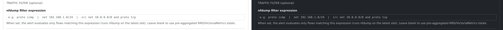
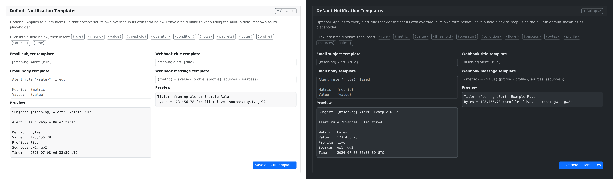
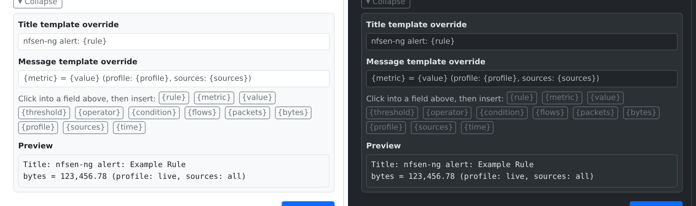

# Setting Up Alerts

Alerts watch a metric (flows, packets, or bytes) and notify you when it
crosses a threshold — checked automatically every time new traffic data
comes in, no need to keep the dashboard open.

Find them under **Settings → Alerts**:

## Creating a rule

Fill in the **New Alert Rule** form:

1. **Rule name** — anything memorable, e.g. "High traffic on gw1".
2. **Profile** — which nfdump profile this rule watches (usually `live`).
3. **Condition** — pick a **Metric** (Bytes/s, Packets/s, Flows/s), an
   **Operator** (`>`, `>=`, `<`, `<=`), a **Threshold type**, and a
   **Value**:
   - **Absolute value** — fire when the metric crosses this number
     directly.
   - **Percent of average** — fire when the metric is this percent above/below
     its own rolling average (choose the averaging window separately). Use
     this for "alert me when traffic is unusually high *for this network*"
     rather than a fixed number that might be normal for one link and
     alarming for another.
4. **Cooldown** — how many 5-minute cycles to wait before this rule is
   allowed to fire again, so a sustained spike doesn't flood you with
   repeat notifications.
5. **Notifications** — an email address and/or a webhook URL. Leave both
   blank for an in-app-only alert (visible in the Recent Alert History list
   below the form).

Click **Create rule** when you're done. Existing rules appear in the table
above, where you can enable/disable, delete, or test-fire each one on
demand with the **Test** button.

## Scoping an alert to specific traffic

By default, a rule watches your *total* traffic for its metric. Often you
want something narrower — "alert only on ICMP", "alert only for this
subnet." That's what the **Traffic filter** field is for:

Type any nfdump filter expression — the same syntax as the
[Flows](browsing-flows.md) tab's filter field:

| You want to watch | Traffic filter |
|---|---|
| Only ICMP traffic | `proto icmp` |
| Only one subnet | `net 192.168.1.0/24` |
| Traffic from one subnet, TCP only | `src net 10.0.0.0/8 and proto tcp` |

When this field is set, the rule runs a real (small, fast) nfdump query over
the most recent data instead of using pre-aggregated totals — so it can
scope to exactly the traffic you described, at the cost of being slightly
more expensive to evaluate than an unfiltered rule. Leave it blank for
"total traffic," which is cheaper and is all you need for a general
high-traffic alert.

If you type something nfdump doesn't understand, the rule simply doesn't
fire (rather than erroring loudly) — double-check the syntax with the
[Flows](browsing-flows.md) tab first if a filtered alert never seems to
trigger.

## Customizing the notification text

By default, email and webhook notifications use a fixed subject/title and
body/message. You can override this — useful for phrasing Gotify or Apprise
notifications your own way, or inserting the actual traffic numbers into
the message instead of just getting a generic "an alert fired."

There are two levels, checked in order: a **rule's own override** (if set),
then a **global default** (if set), then the built-in text shown above as
each field's placeholder.

**Global defaults** apply to every rule that doesn't set its own override.
Expand **Default Notification Templates** at the top of the Alerts page:

**Per-rule overrides** live in each rule's own form, collapsed behind a
**Customize email message** / **Customize webhook message** toggle next to
the Email address / Webhook URL fields:

Either way, click into a template field, then click one of the variable
buttons to insert it at your cursor:

| Variable | Value |
|---|---|
| `{rule}` | Rule name |
| `{metric}` | Which metric fired (`flows`, `packets`, or `bytes`) |
| `{value}` | That metric's current value |
| `{threshold}` | The threshold that was crossed |
| `{operator}` | The comparison operator (`>`, `>=`, `<`, `<=`) |
| `{condition}` | `{metric} {operator} {threshold}`, combined |
| `{flows}`, `{packets}`, `{bytes}` | All three counters, regardless of which one the rule watches |
| `{profile}` | The nfdump profile |
| `{sources}` | The rule's sources, comma-separated |
| `{time}` | When the alert fired (UTC) |

The **Preview** box below each pair of fields updates live as you type,
using made-up example numbers — it's a preview of the *template*, not a
real fired alert. To see the real, resolved text for a specific rule, use
the **Test** button (its result includes the actual rendered title/message
alongside the fire/no-fire verdict).

## Testing before you rely on it

Click **Test** on any rule to evaluate it immediately against current data
and see whether it *would* fire — without waiting for the next automatic
cycle, and without needing to actually breach the threshold for real. Good
practice after creating or editing a rule, especially one with a traffic
filter, before trusting it to notify you unattended.
