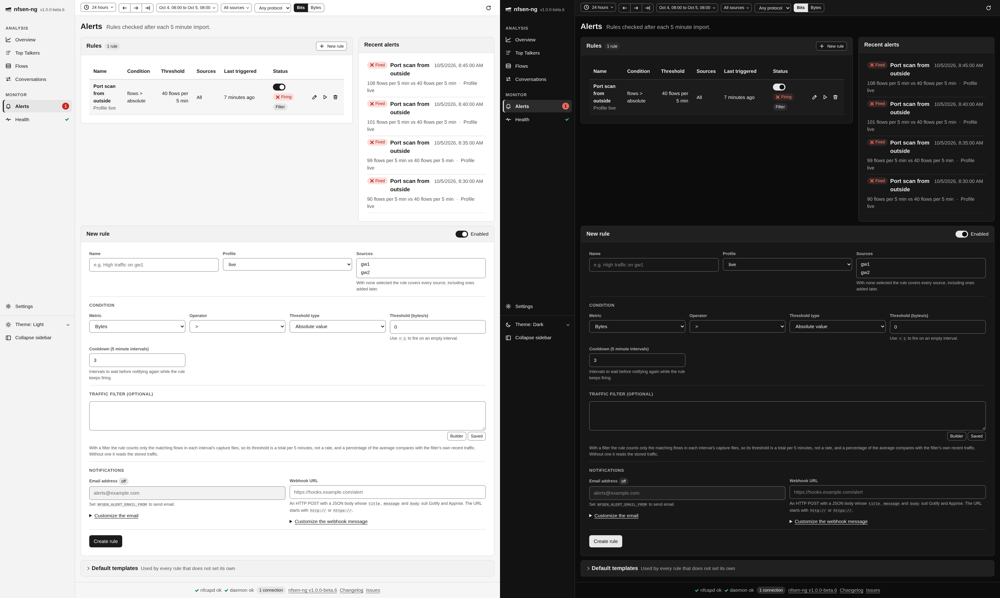
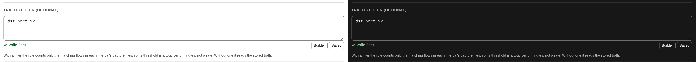
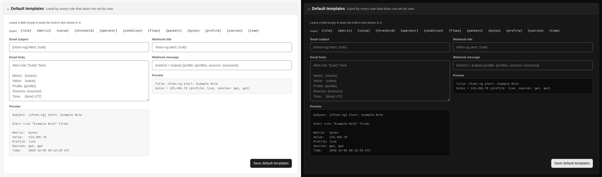
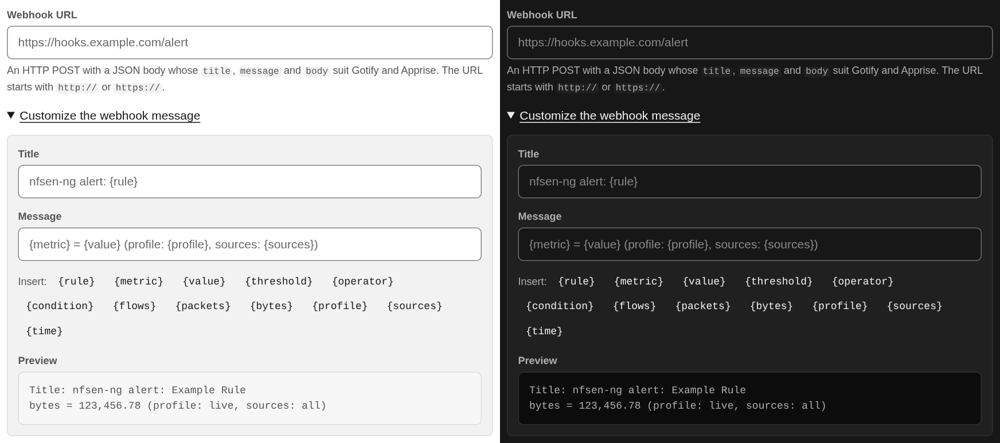

# Setting Up Alerts

Alerts watch a metric (flows, packets or bytes) and notify you when it crosses a
threshold. They are checked automatically for every five-minute interval as the
import brings it in, so nobody has to keep a browser open.

They live on the **Alerts** page:

The **Rules** table lists every rule with its condition, threshold, sources, when
it last fired, and a switch to turn it on or off. The status says **OK**,
**Firing** or **Disabled**, and the sidebar shows how many rules are firing.
**Recent alerts** beside it shows the last 50 events, newest first:

- **Fired**: the condition held for an interval (and a notification went out,
  unless the rule is in its cooldown).
- **Resolved**: a rule that had fired found the condition false again on a later
  interval. This is recorded but not notified.
- **Test**: somebody pressed **Test** on the rule.

## Creating a rule

Press **New rule** and fill in the form below the table:

1. **Name**: anything memorable, e.g. "High traffic on gw1".
2. **Profile**: which nfdump profile the rule watches (usually `live`).
3. **Sources**: the exporters to add up. With none selected the rule covers every
   source, including ones added later.
4. **Condition**: pick a **Metric** (Flows, Packets, Bytes), an **Operator**
   (`>`, `>=`, `<`, `<=`), a **Threshold type** and a value:
   - **Absolute value**: fire when the metric crosses this number. Use `< 1` to
     fire on an empty interval.
   - **% of rolling average**: fire when the metric is this percent of its own
     average over the window you choose in **Average over** (10 min to 24 h). Use
     this for "alert me when traffic is unusually high *for this network*" rather
     than a fixed number that might be normal for one link and alarming for
     another. A rule of this type waits until there is an average to compare with.
5. **Cooldown (5 minute intervals)**: how many intervals to wait before notifying
   again while the rule keeps firing, so a sustained spike doesn't flood you.
6. **Notifications**: an email address and/or a webhook URL. Email works only
   when the administrator set a sender address (`NFSEN_ALERT_EMAIL_FROM`); the
   form says when it is off. Leave both empty for a rule that only shows up on
   this page.

The switch in the form's header decides whether the rule starts enabled. Press
**Create rule**. To change a rule, press its **Edit** button; the form fills in,
the button says **Update rule**, and **Cancel edit** leaves the rule as it was.

## Scoping an alert to specific traffic

By default a rule watches all traffic of its sources. Often you want something
narrower: "alert only on ICMP", "alert only for this subnet". That is what the
**Traffic filter** field is for:

Type any nfdump filter, the same syntax as on [Flows](browsing-flows.md); the
field checks it against nfdump as you type, and **Builder** and **Saved** open
the [filter builder](filter-builder.md). A rule with a filter nfdump rejects
cannot be saved.

| You want to watch | Traffic filter |
|---|---|
| Only ICMP traffic | `proto icmp` |
| Only one subnet | `net 192.168.1.0/24` |
| Traffic from one subnet, TCP only | `src net 10.0.0.0/8 and proto tcp` |

With a filter, the rule runs a small nfdump query over the interval's capture
files and counts only the matching flows. Its value is then a **total per five
minutes**, not a rate, so set the threshold accordingly. Without a filter it
reads the stored series, which is cheaper and all you need for a general
high-traffic alert.

## When rules are checked

Every rule is evaluated once per five-minute interval and profile, as soon as
every source has delivered its capture file for that interval, in whatever order
the files arrive. A source that has nothing waiting once a later interval is in
counts as down and is left out until it reports again, so one dead exporter
does not stop the rules of the others.

## Customizing the notification text

By default, email and webhook notifications use a fixed subject/title and
body/message. You can override this, for example to phrase Gotify or Apprise
notifications your own way, or to put the actual traffic numbers into the message.

There are three levels, checked in order: a **rule's own override** (if set), then
a **global default** (if set), then the built-in text shown as each field's
placeholder.

**Global defaults** apply to every rule that doesn't set its own override. Open
**Default templates** below the rule form, edit, and save them there:

**Per-rule overrides** live in the rule form, folded behind **Customize the
email** and **Customize the webhook message** under the email address and the
webhook URL:

Either way, click into a template field, then click one of the variable buttons
to insert it at your cursor:

| Variable | Value |
|---|---|
| `{rule}` | Rule name |
| `{metric}` | Which metric fired (`flows`, `packets`, or `bytes`) |
| `{value}` | That metric's value in the interval |
| `{threshold}` | The threshold that was crossed |
| `{operator}` | The comparison operator (`>`, `>=`, `<`, `<=`) |
| `{condition}` | `{metric} {operator} {threshold}`, combined |
| `{flows}`, `{packets}`, `{bytes}` | All three counters, regardless of which one the rule watches |
| `{profile}` | The nfdump profile |
| `{sources}` | The rule's sources, comma-separated; all configured sources when the rule has none selected |
| `{time}` | The start of the data interval that fired, in UTC |

The **Preview** under each pair of fields updates as you type, using made-up
example numbers: it previews the *template*, not a real alert. To see the real
text for a rule, use **Test**.

## Testing before you rely on it

**Test** in a rule's row evaluates it right away against the newest complete
interval, with the same sources the live evaluation would use (a source that is
down is left out), and opens a dialog with the answer:

- **Would fire** or **Would not fire**, with the value and the threshold it was
  compared with, or why there is none yet;
- what happened with the notification: sent (to which channel; with both email
  and a webhook set up, "at least one of" them, since one result covers both),
  not sent because the rule would not fire, or not sent because email is off on
  this server;
- the start of the interval it tested;
- the email subject and body and the webhook title and message, rendered with
  the real figures.

A test that fires sends the notification for real, so you can check the email or
the webhook receiver too. It is recorded as a **Test** event and does not touch
the rule's firing state or cooldown. Test a rule after creating or editing it,
especially one with a traffic filter, before trusting it to notify you
unattended.
