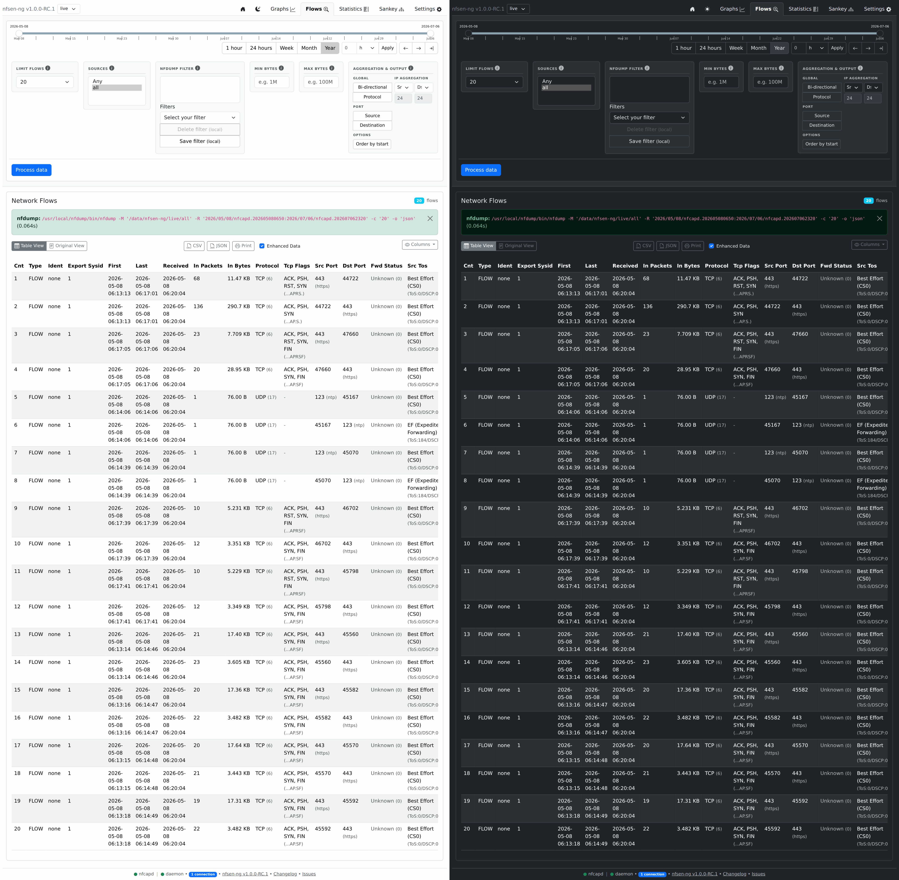
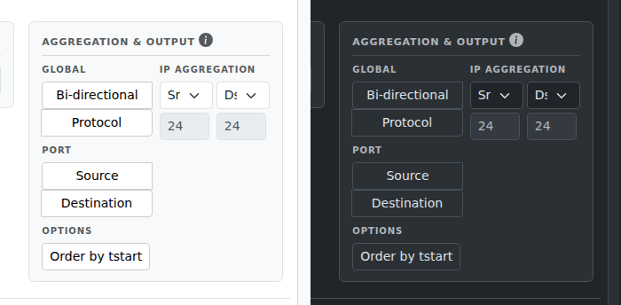

# Browsing Flows

The **Flows** tab lists individual flow records for a time window — the
detail view behind the aggregate charts. Use it when you know roughly *when*
something happened and want to see exactly *what*.

## Running a query

Unlike the Graphs tab, Flows doesn't query automatically — set your date
range and filters, then click **Process data**. This runs the real `nfdump`
tool against your capture files, which is shown to you verbatim above the
results table (handy for confirming exactly what was asked for, or for
copy-pasting into a terminal if you want to run the same query outside the
UI). A **Kill** button appears next to it while a query is running, in case
you asked for more than you meant to.

## Filters

| Control | What it does |
|---|---|
| **Limit flows** | Cap on how many records come back |
| **Sources** | Which exporter(s) to include |
| **nfdump filter** | Free-text nfdump filter syntax, e.g. `proto tcp and dst port 443` |
| **Min / max bytes** | Only show flows within a byte-count range |

If you don't already know nfdump's filter syntax, start simple —
`proto icmp`, `net 192.168.1.0/24`, `dst port 22` — and combine with `and`/
`or` as needed. Save anything you use often as a filter preset (see
[Preferences](preferences.md)) so it's a dropdown pick next time instead of
retyped text.

## Aggregation & output

For summarizing rather than listing every raw flow, the aggregation panel
combines matching flows together:

- **Global**: combine both directions of a conversation into one row
  (Bi-directional), and/or collapse by protocol.
- **Port**: collapse by source port and/or destination port.
- **IP Aggregation**: collapse source/destination addresses down to a
  subnet (e.g. a /24) instead of listing every individual host.
- **Options**: order results by start time.

These map directly onto how nfdump itself aggregates flows — if you already
know nfdump's `-a`/aggregation flags, this panel is that, with a form
around it.

## Looking up an address

Click any IP address in the results table to see where it is and who it
belongs to — see [Looking Up an IP](ip-lookup.md).
