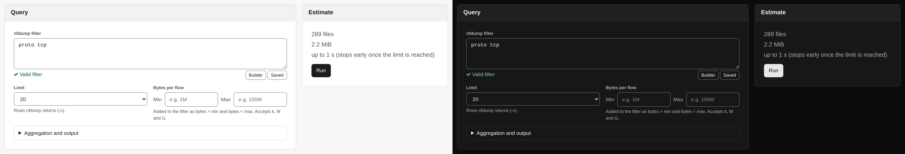
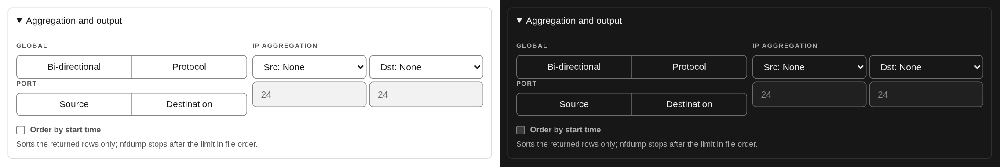
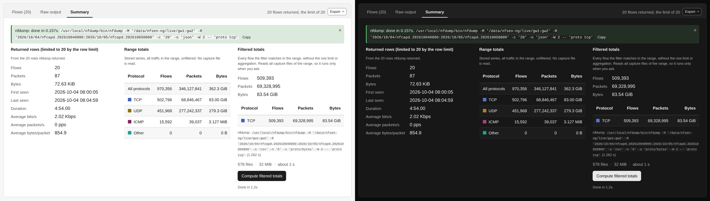

# Flows

**Flows** lists individual flow records for the range: the detail behind the
graphs and rankings. Use it when you know roughly *when* something happened and
want to see exactly *what*.

## Setting up a query

The **Query** card holds everything specific to this page; the range, the sources
and the protocol come from the controls bar.

| Control | What it does |
|---|---|
| **nfdump filter** | Free nfdump filter syntax, e.g. `proto tcp and dst port 443`, checked against nfdump as you type |
| **Limit** | How many rows nfdump returns (`-c`): 20, 50, 100, 500, 1,000 or 10,000 |
| **Bytes per flow** | **Min** and **Max**, added to the filter as `bytes > min` and `bytes < max` (accepts `k`, `M` and `G`) |
| **Aggregation and output** | Folded away by default, see below |

If you don't know nfdump's filter syntax yet, start simple (`proto icmp`,
`net 192.168.1.0/24`, `dst port 22`) and combine with `and` and `or`, or open
**Builder** next to the field for a reference of every field and a list of
examples. **Saved** lists the filters you saved; see
[Filter builder](filter-builder.md).

The **Estimate** card next to the query says what a run would read before you
start it: the number of capture files, their size, and how long that takes at
most. A Flows query stops as soon as nfdump has the rows the limit asks for, so
the time is an upper bound and says *stops early once the limit is reached*.

Press **Run** to start. The button shows how far nfdump has read and the time
left, and **Kill** stops the run.

## Aggregation and output

To summarise rather than list every flow, open **Aggregation and output**:

- **Global**: **Bi-directional** combines both directions of a conversation into
  one row, and **Protocol** collapses by protocol.
- **Port**: **Source** and **Destination** collapse by port.
- **IP Aggregation**: per direction, collapse addresses to the exact IP or to an
  IPv4 or IPv6 prefix such as a /24, instead of listing every host.
- **Order by start time** sorts the returned rows. nfdump still stops after the
  limit in file order, so it sorts what came back, not the whole range.

These map onto nfdump's own aggregation (`-a`, `-A` and `-B`): the panel is a
form over nfdump's options, not a reimplementation of them.

## Reading the result

The result has three tabs, and the line next to them says how many rows came back
and whether the limit was reached (or, for an aggregated query, how many flows
were aggregated).

**Flows** is the table. It shows 50 rows per page; the pager below it switches to
25, 100 or 250 and says *Showing 1-50 of 1,234 returned (limit 10,000)*. nfdump
cannot skip rows, so when the limit is reached the pager says so: raise the limit
to see more. Click a column header to sort, use **Columns** to hide columns,
and **Export** to save the rows as CSV or JSON or print them. With **Enhanced
data** on, the export has the values as shown; off, it has the raw numbers.
Click an IP address to [look it up](ip-lookup.md).

**Raw output** is what nfdump printed, untouched: the command it ran (with
**Copy**, handy for running the same query in a terminal), the lines nfdump
printed beside the data, and its output with **Copy** and **Download**. The page
keeps the first 5 MiB of a very large output and says so.

**Summary** puts the rows into context, in three blocks:

- **Returned rows**: flows, packets, bytes, first and last seen, duration and
  averages of the rows nfdump returned, which the row limit may have cut short.
- **Range totals**: all traffic of the range from the stored series, unfiltered,
  split by protocol. No capture file is read, so it is there right away.
- **Filtered totals**: every flow the filter matches in the range, without the
  row limit or aggregation. That reads every capture file of the range, so it
  has its own estimate and runs only when you press **Compute filtered totals**.

## Seeing when your flows happened

**Traffic over time**, the folded section between the query and the result, plots
the current filter over the range:

It answers "when did this happen" without describing the query twice. The graph
uses the filter you typed, including the byte limits, so it shows exactly the
traffic the table lists. Pick **Bytes**, **Packets** or **Flows** above it. With
several sources selected it draws one line per source, otherwise one per
protocol.

Two things it states on screen. The row limit and the aggregation do not apply
to it, because they truncate and regroup the table rather than change which
records match, so a table of 100 rows can sit beside a graph of every matching
byte. And plotting a filter means reading capture files, one nfdump run per
interval, so it never builds on its own: the section says what it would read and
waits for **Build graph**.

If the query or the window moves after a build, the section says so and keeps
the graph it built.
