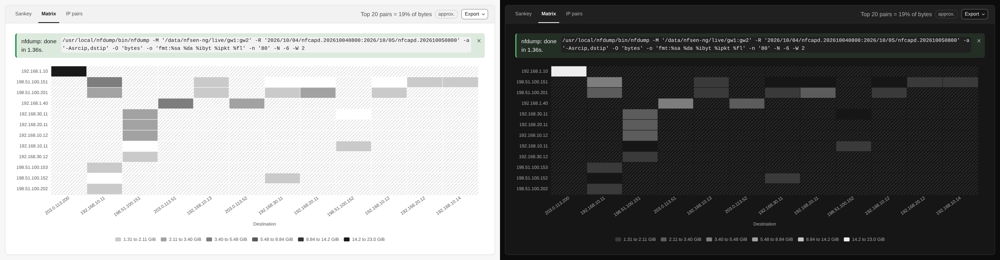
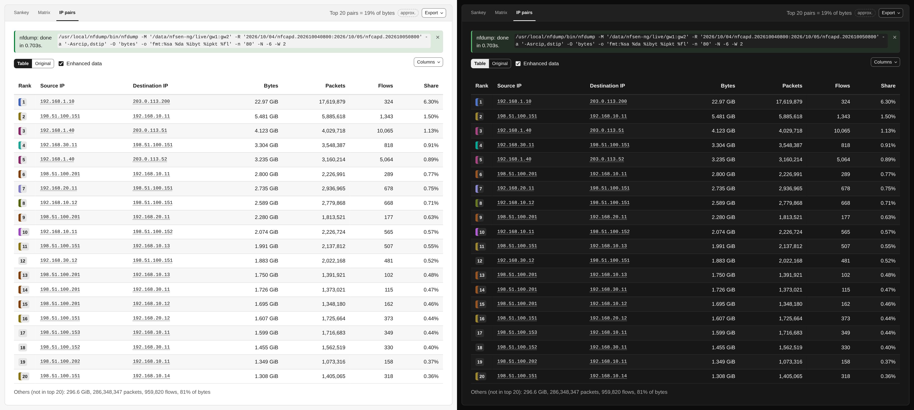

# Conversations

**Conversations** shows *who talks to whom*: the busiest source and destination
pairs of the range, drawn three ways from one query. The widest band, the darkest
cell and the first row are the same conversation.

## When to reach for this instead of Top Talkers

[Top Talkers](top-talkers.md) ranks addresses one side at a time: "top 10 source
IPs" and "top 10 destination IPs" are two separate lists. Conversations shows the
*relationship* between them, which sources drive traffic to which destinations,
without cross-referencing two tables yourself.

## Running a query

| Control | What it does |
|---|---|
| **Group by** | **IP address**, **/24 subnet**, **/16 subnet**, or **Destination port** (source IP to port to destination IP) |
| **Direction** | **Both** adds up both directions of each pair; **Source to destination** keeps each direction as its own pair |
| **Metric** | Rank and size by **Bytes** or **Packets** |
| **Top pairs** | How many pairs to show: 10, 20, 50, 100 or 200 |
| **nfdump filter** | Any nfdump filter, checked as you type |
| **Bytes per flow** | Leave out flows below **Min** or above **Max** bytes (accepts `k`, `M` and `G`) |

The range, the sources and the protocol come from the controls bar. Check the
estimate and press **Run**.

A few combinations have rules. **Both** is not available with **Destination
port**, because a port belongs to one direction. With **Both**, the busier sender
of a pair becomes its source; nfsen-ng merges the directed pairs itself, from
four times as many as you asked for (at most 2000), so a pair near the end of a
long list can miss part of its reverse traffic, and the summary line then carries
an **approx.** badge. Subnet grouping covers IPv4 only, and the card says so.

Past a certain count the Sankey gets crowded rather than more useful, so start
with 10 or 20 pairs and widen only if you need to.

## Reading the result

The line above the views sums up the result, e.g. *Top 20 pairs = 64% of bytes*.
The tabs switch between three views of the same pairs.

**Sankey** draws each pair as a band from its source to its destination, as wide
as its bytes or packets. The traffic outside the top pairs becomes an **Others**
node in each column, so the diagram accounts for all the traffic the query
matched. Click an address to [look it up](ip-lookup.md).

With **Destination port**, the Sankey gets a middle column: **source IP → port →
destination IP**. That answers *which service* a conversation used, e.g. that one
host's traffic to a server is all `443` while another's is `22`. The port column
pools traffic per port, so a busy port shows up as one thick node fed by every
source and fanning out to every destination that used it. ICMP has no ports;
its flows appear as *ICMP type.code*, such as `ICMP 8.0` for echo requests.

**Matrix** puts the sources on one axis and the destinations on the other, with
a darker cell for more traffic. A hatched cell is a pair outside the top pairs:
its traffic is unknown, not zero. Point at a cell for the figures.

**IP pairs** is the ranked table, with bytes, packets, flows and each pair's
**Share** of the total. Below it, **Others** sums up the traffic outside the top
pairs. Addresses link to the IP lookup.

## Exporting

**Export** offers the IP pairs as CSV or JSON, a PNG of the Sankey or the Matrix
(whichever is open), and **Copy nfdump command**. The exported Share is a
percentage with **Enhanced data** on, and the raw fraction with it off.
