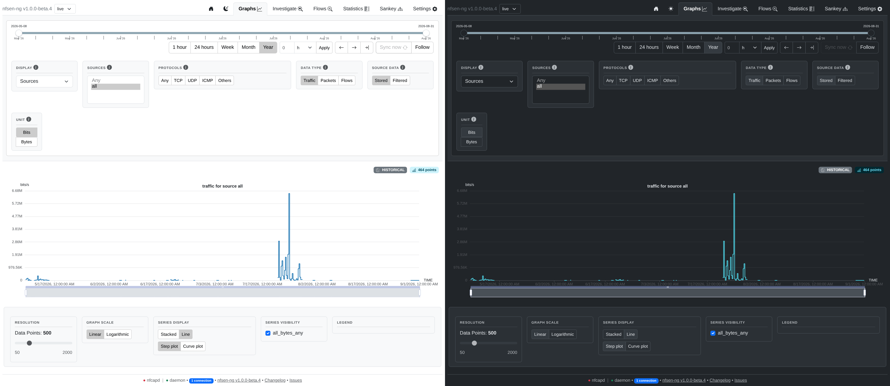
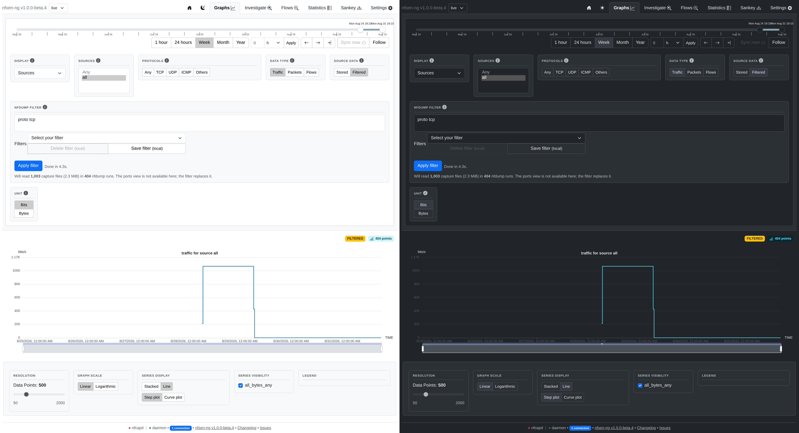

# The Dashboard

The **Graphs** tab is a live time-series chart of your traffic — the first
thing you see, and the one tab that updates itself without you clicking
anything.

## Reading the chart

The chart title ("traffic for source all") and the **LIVE** badge above it
tell you what's plotted and confirm you're looking at current data — the
timestamp next to it is the last time new data arrived. As new nfcapd files
land, the chart extends itself automatically; no refresh needed.

## Choosing what to plot

The filter panel above the chart controls what you see:

| Control | What it does |
|---|---|
| **Source data** | **Stored** — the pre-aggregated database series, which is what you normally want. **Filtered** — see below |
| **Display** | Group the chart by **Sources** (one line per exporter), **Protocols** (one line per protocol), or **Ports** (one line per tracked port) |
| **Sources** | Which exporter(s) to include — pick specific ones, or `all` |
| **Protocols** | Filter to TCP / UDP / ICMP / Others, or Any |
| **Data type** | Traffic (bytes), Packets, or Flows |
| **Unit** | Bits or Bytes (only applies to Traffic) |

Below the chart, a few display-only controls let you adjust how it's
rendered without re-querying anything: number of data points (resolution vs.
render cost), linear vs. logarithmic scale, stacked vs. line series, and
step vs. curve interpolation.

## Asking a narrower question

The chart normally plots everything the database recorded, and the database
records totals only — so there's nothing in it to narrow down by IP or port
after the fact. Switching **Source data** to **Filtered** re-reads the raw
capture files instead, which means you can type any nfdump filter (the same
kind you'd use on the [Flows](browsing-flows.md) tab) and get a graph of just
that traffic:

This costs real time — it re-reads every capture file in the window — so it
never runs on its own: nothing happens until you click **Apply filter**, and
the graph doesn't keep updating itself afterwards. You get a progress bar with
an ETA while it works, and a **Kill** button if you asked for more than you
meant to. Narrow the date range first; it's the window width, not the number of
points, that decides how long it takes.

The **Investigate** tab puts this graph and the flow table on one screen, so
you can read the same filter as a timeline and as individual records at the
same time — see the [Quick Tour](quick-tour.md#the-investigate-tab).

## Zooming in

Drag across the chart itself to zoom into a specific window — the date
range slider above updates to match. Use the slider's **←**/**→** buttons
or drag its handles to move the window instead of re-selecting on the
chart every time.

## What's next

Once you spot something interesting on the graph — a spike, an unfamiliar
protocol share — the natural next step is
[Browsing Flows](browsing-flows.md) or [Statistics](statistics.md) for the
same time window, to see exactly *which* conversations made up that
traffic.
