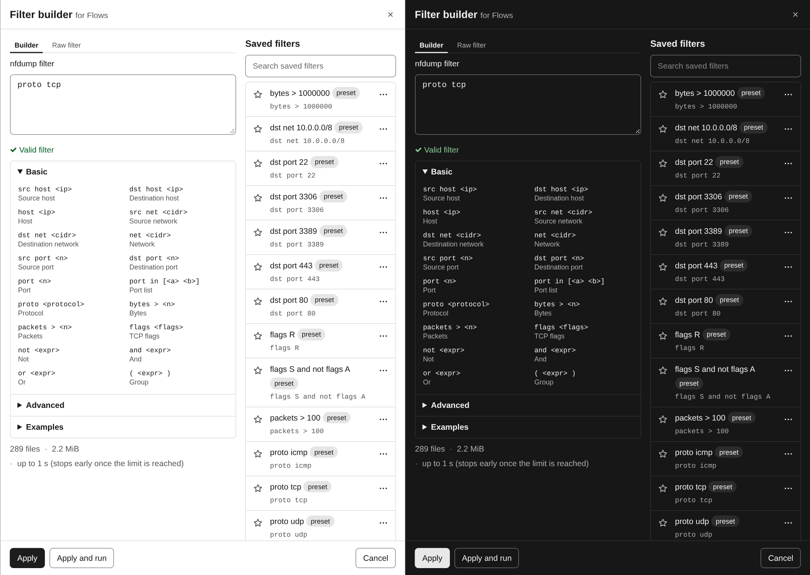
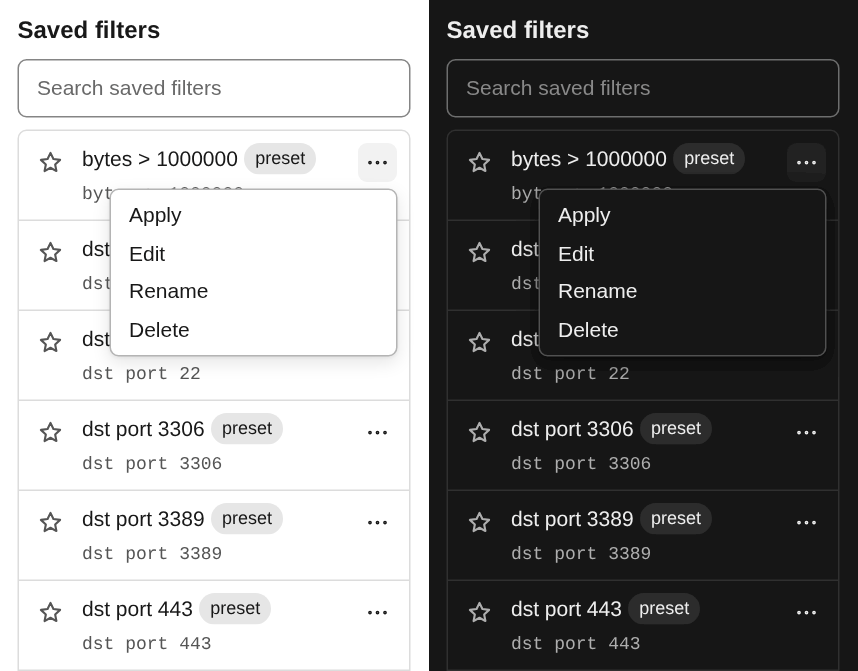

# Filter builder

Every nfdump filter field has two buttons under it, **Builder** and **Saved**.
Both open the filter builder, a drawer over the page that edits that field: the
filter of a filtered graph on Overview, of Top Talkers, Flows or Conversations,
or the traffic filter of an alert rule. Its title says which one, e.g. *Filter
builder for Flows*.

## Writing a filter

The **Builder** tab has the filter text on top and a reference below it:

- **Basic** and **Advanced** list the fields and operators nfdump understands,
  such as `src host <ip>`, `dst port <n>`, `proto <protocol>`, `net <cidr>`,
  `bytes > <n>` or `flags <flags>`, each with a short description. Click one to
  insert it at the cursor.
- **Examples** are complete filters for common questions, from *Web traffic* and
  *DNS* to *TCP SYN without ACK*. Click one to insert it.
- While you type, a list suggests the keywords that match the word at the cursor.
  **Arrow up** and **Arrow down** move through it, **Enter** or **Tab** takes a
  suggestion, **Escape** closes the list.

The words in angle brackets are placeholders. The first one is selected after
inserting, so typing replaces it, and **Tab** selects the next one.

The **Raw filter** tab is a larger text area for long filters. Several lines are
one filter, and `#` starts a comment that runs to the end of the line.

Under the text, the filter is checked against nfdump itself a moment after you
stop typing: **Valid filter**, or nfdump's error message. When the builder edits
a query, the drawer also shows that query's estimate for the current range.

## Applying

**Apply** writes the text into the field the drawer was opened for and closes it.
**Apply and run** does the same and presses that page's **Run**; an alert rule has
no Run, so there the button is missing. **Cancel**, **Escape** or the close
button leave the field as it was. The drawer keeps what you typed, though: open it
again for the same field and it says *Unapplied draft restored*, with **Discard
draft** to start from the field's text instead.

## Saved filters

The right-hand side of the drawer lists the saved filters. The list lives on the
server, in the SQLite store, so everyone who uses this nfsen-ng instance sees the
same filters in every browser.

- **Search** narrows the list by name and expression.
- The **star** in front of a filter keeps it at the top: starred filters come
  first, then the ones used most recently.
- Each filter's menu offers **Apply** (load it into the editor, from where the
  drawer's **Apply** or **Apply and run** takes it into the field), **Edit** (load
  it into the editor to change it; **Save changes** then updates the saved
  filter), **Rename** (type the new name, **Enter** saves, **Escape** cancels) and
  **Delete**.
- **Save current filter** stores the text in the editor under the name you type,
  or under the filter itself if you leave the name empty. Each expression is
  saved once: saving one that differs only in spaces says *Already saved as* and
  names the filter you have.

Filters marked **preset** came from the deployment (`NFSEN_FILTERS` or
`settings.php`) or from the old *Filter presets* list in Settings. They behave
like any other saved filter, and a preset you delete stays deleted.

## Filters from before the upgrade

Earlier versions kept saved filters in each browser. The first time a browser
opens this version, the drawer imports that browser's list into the saved
filters, once; if the import fails, the browser tries again on the next load. The
filter presets that were saved in Settings are moved into the list the first time
the server reads it. See [Upgrading](../deployment/upgrading.md#what-happens-on-the-first-start).
