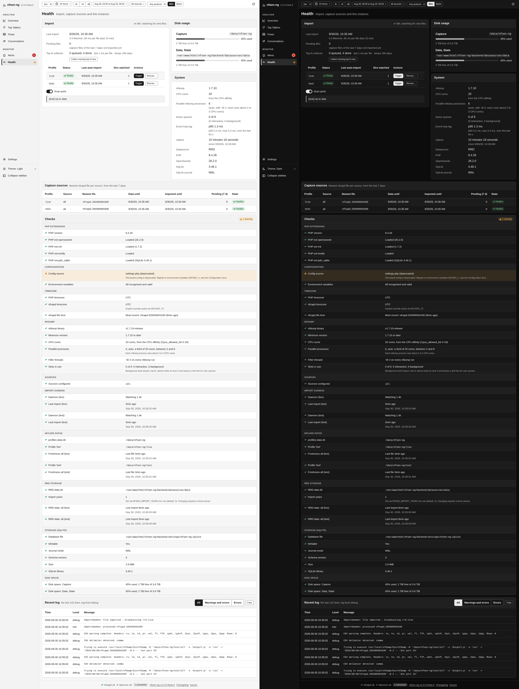
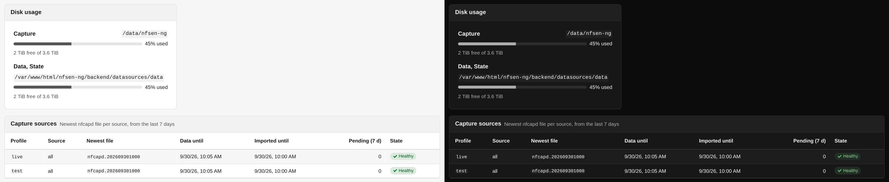
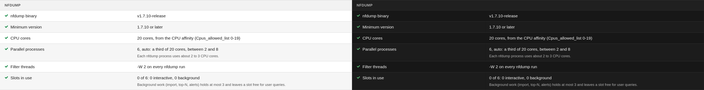

# Health

The **Health** page is for keeping nfsen-ng itself running: whether the import
keeps up, whether every exporter still delivers, how full the disks are, and a
checklist of the whole setup with advice for anything that is not green. The
sidebar dot next to *Health* shows the worst check result on every page.

While the page is open it refreshes every 10 seconds. The checks themselves are
recomputed in the background at most every 30 seconds, so opening the page never
waits for them.

## Import

The **Import** card says whether the import daemon is running, idle and watching
for new files, starting, or disabled (`NFSEN_SKIP_DAEMON`). Below that:

- **Last import**, with the rate of the last 15 minutes in files per minute and
  milliseconds per file.
- **Pending files**: capture files of the last seven days that are not imported
  yet.
- **Top-N collector**: how many capture files wait for their top-N lists or are
  being collected, how many are done or failed, the time the last one took, and
  how many days are kept. **Collect missing top-N now** looks for intervals of
  the retention window that have no lists yet and queues up to 500 of their
  files at once, and more as those are done, instead of waiting for the
  collector's next pass. See [Overview](overview.md#top-of-the-range) for what
  the lists are for.

The table lists each nfdump profile with its daemon status, its last automatic
import and how many directories it watches. New nfcapd files are picked up and
imported as they are written, so you normally never press anything here. Three
buttons exist for when you need to step in:

- **Trigger** re-runs the catch-up import for the profile. Use it after pointing
  nfsen-ng at a directory with history it has not seen, or when you suspect it
  missed something.
- **Backfill** (VictoriaMetrics) re-reads *every* capture file, including those
  older than the newest sample already stored, and writes each one to the slot
  it belongs to. Nothing is deleted. Use it for an archive of `nfcapd` files that
  predates the install: a normal Trigger starts at the newest sample and never
  looks behind it. It reads the whole archive, so it takes a while.
- **Rescan** (RRD) resets the profile's stored data and re-imports everything
  from scratch. This is destructive and asks for confirmation first; use it only
  if the data looks wrong and Trigger doesn't fix it.

Which of the last two you see depends on the datasource. RRD files are written in
time order and RRDTool refuses an update at or before the file's last update, so
filling in history means rebuilding the file. A VictoriaMetrics sample is
addressed by its timestamp, so an old capture can be written where it belongs,
and a destructive reset would be pointless there.

**Scan ports** decides whether a manual pass also rebuilds the per-port series.
While a pass runs, the card shows its progress, the time left and the current
file, the controls bar shows an import chip, and **Cancel import** stops it.
Warnings and errors of the last pass are listed under **Import log**, the newest
100 of them, with the count of all (*3 warnings, 1 error, the last 100 shown*).

## Capture sources

**Capture sources** has one row per profile and source: the newest capture file,
the time its data reaches, how far it is imported, how many files of the last
seven days wait, and a state:

- **Healthy**: a new file arrived in the last 12 minutes.
- **Stale**: no new file for more than 12 minutes. The exporter or nfcapd stopped.
- **No data**: no capture file in the last seven days.
- **Missing**: the source directory does not exist.

## Disk usage and system

**Disk usage** shows how full the filesystems are that hold the capture files,
the RRD data and the state directory (with the SQLite store); directories on the
same filesystem share a row. It turns to a warning at 85 % and an error at 95 %,
since nfcapd, the import and the SQLite store fail once a disk is full.
VictoriaMetrics data lives elsewhere and is not measured.

**System** lists the nfdump version, the CPU cores nfsen-ng may use and where
that number came from, **Parallel nfdump processes** (for example *6 (auto, with
-W 2; each uses about 2 to 3 CPU cores)* on 20 cores), **Active queries** (*1 of 6
(1 interactive, 0 background)*, plus how many wait), the **Event loop lag**, the
uptime, the datasource, and the PHP, OpenSwoole and SQLite versions with SQLite's
journal mode. How many nfdump processes run at once is set by
`NFSEN_NFDUMP_MAX_PROCESSES`; see
[nfdump processes and CPU cores](../deployment/configuration.md#nfdump-processes-and-cpu-cores).

**Event loop lag** says how late the server answers: one process serves every
tab, and while it is busy with something (a render, a scan of a capture
directory, a database write), every click, live update and timer waits. The row
shows the p95, the median (p50) and the maximum delay over the last minute. A
p95 of 100 ms or more gets the warning sign, 1 s or more the error sign; either
means the server is too busy for its tabs, usually during a large import or
backfill.

## Checks

**Checks** runs down the setup in groups, each entry marked OK, Warning or Error,
with a note on what to do about anything that isn't OK:

- **PHP Extensions**: the PHP version and the extensions nfsen-ng needs,
  including `pdo_sqlite`.
- **Configuration**: environment variables that are invalid, deprecated or
  unknown (typos), a `settings.php` in use, and settings that contradict each
  other.
- **Timezone**: the PHP timezone, `NFCAPD_TZ`, and **nfcapd file time**, which
  warns when the newest file's name is far from the time it was written, the
  usual sign of a wrong `NFCAPD_TZ`.
- **nfdump**: the binary; **Minimum version**, a warning below 1.7.10 whose note
  says what the installed version lacks (the security fixes of 1.7.9, or the
  Bi-directional pairing that gcc builds of 1.7.8 and 1.7.9 get wrong); **CPU
  cores**, **Parallel processes** and **Filter threads** (the `-W` passed to
  every run); and **Slots in use**, how many nfdump processes run right now, for
  user queries and for background work.
- **Sources**, **Import Daemon** and **nfcapd Paths**: the configured sources, the
  daemon, and each capture directory with its freshness.
- **RRD Storage** or **VictoriaMetrics**: the datasource.
- **Storage (SQLite)**: the database file, whether it is writable, its journal
  mode, schema version and size, and the SQLite library version. The journal
  mode says *Rollback journal (DELETE)* where the filesystem refused WAL, which
  FUSE mounts such as Unraid's user shares can do. Everything works in that mode;
  reads wait while a write runs.
- **Disk space**: the same filesystems as the Disk usage card.

## Recent log

**Recent log** keeps the server's last 200 log lines in memory, at the log level
set in [Settings](settings.md). Show **All**, **Warnings and errors**, or only
**Errors**, and **Copy** them for a bug report.
