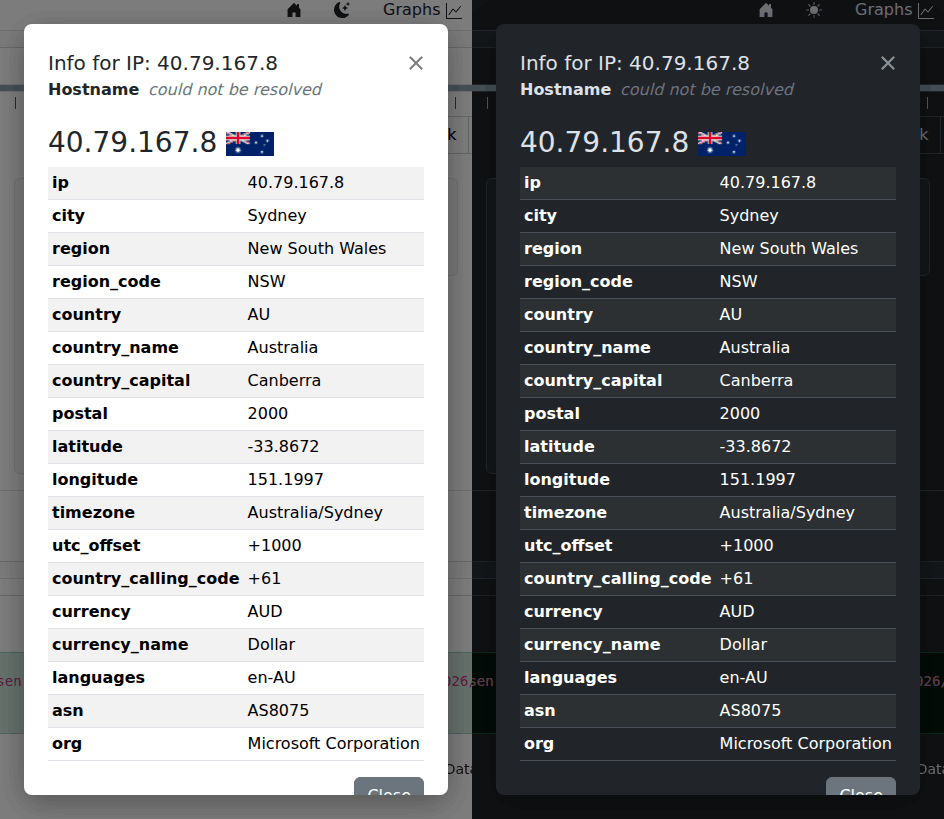

# Looking Up an IP

Any IP address shown as a link in the [Flows](browsing-flows.md) or
[Statistics](statistics.md) tables — click it, and a popup gives you context
on that address without leaving the page or opening a new tab.

## What you get

- **Hostname** — reverse DNS, if the address resolves to one.
- For a **public** address: geolocation — city, region, country, timezone —
  plus network ownership info (ASN, organization). Useful for a quick "is
  this a cloud provider, a CDN, or somewhere unexpected?" sanity check on an
  unfamiliar destination.
- For a **private** address (RFC 1918, e.g. `192.168.x.x`, `10.x.x.x`) —
  geolocation obviously doesn't apply, so instead you get whatever your
  organization's [Netbox](https://netboxlabs.com/) IPAM has on record for
  it, if your administrator has connected one (see
  [Preferences](preferences.md) for how that's configured).

## A word of caution

The geolocation lookup calls an external service
([ipapi.co](https://ipapi.co/)) over the internet — it only fires for
public addresses, and only when you actually click one, not automatically
for every row in a table. If your nfsen-ng instance has no outbound internet
access, that part of the popup will simply come back empty; reverse DNS and
Netbox lookups (if configured) are unaffected.
