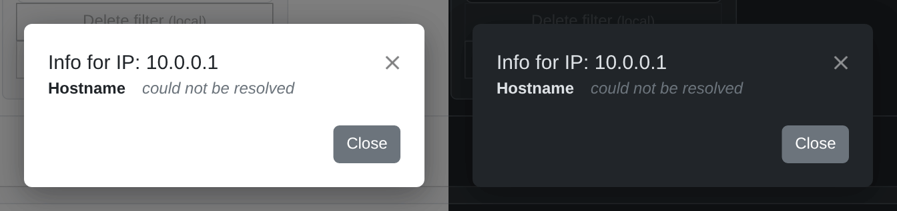

# Looking Up an IP

Any IP address shown as a link in the [Flows](browsing-flows.md) or
[Statistics](statistics.md) tables — click it, and a popup gives you context
on that address without leaving the page or opening a new tab.

## What you get

- **Hostname** — reverse DNS, if the address resolves to one.
- For a **public** address: geolocation — city, region, country flag, timezone —
  plus network ownership info (ASN, organization). Useful for a quick "is
  this a cloud provider, a CDN, or somewhere unexpected?" sanity check on an
  unfamiliar destination.
- For a **private** address (RFC 1918, e.g. `192.168.x.x`, `10.x.x.x`) —
  geolocation obviously doesn't apply, so instead you get whatever your
  organization's [NetBox](https://netboxlabs.com/) IPAM has on record for
  it, if your administrator has connected one: description, tenant, VRF,
  role, status (see
  [Configuration](../deployment/configuration.md#netbox-ip-lookup) for how
  that's set up).

The two answer different questions — *who owns this address out on the
internet?* versus *which of our machines is this?* — and you get exactly
one, decided by the address itself. That split is also a privacy boundary:
an internal address is never sent to the external geolocation service, so
your addressing scheme stays on your network.

## A word of caution

The geolocation lookup calls an external service over the internet —
[ipapi.co](https://ipapi.co/) unless your administrator has pointed it
somewhere else. It only fires for public addresses, and only when you
actually click one, not automatically for every row in a table. If your
nfsen-ng instance has no outbound internet access, that part of the popup
comes back empty; reverse DNS and Netbox lookups (if configured) are
unaffected.

## If the geolocation part shows a warning instead

These services cap how many lookups they answer for free, and the default
one is fairly strict about it. Once you're over the cap the popup says so —
`RateLimited`, or whatever the service calls it — in place of the usual
table. Reverse DNS still works, so you're not flying blind.

It clears on its own once the service's counter resets — which may be the
next minute or the next day, depending on which cap you ran into. If you're
hitting it regularly, ask your administrator to switch services or add an
API key ([Configuration](../deployment/configuration.md#geolocation-lookup)
covers both, and lists several free alternatives).
