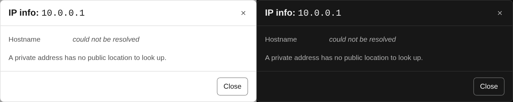

# Looking Up an IP

Every IP address shown as a link opens a dialog with context on that address,
without leaving the page: in the key figures and the top list on
[Overview](overview.md), in the tables of [Top Talkers](top-talkers.md) and
[Flows](browsing-flows.md), and on [Conversations](conversations.md), where you
can also click an address in the Sankey. The dialog stays open while the page
updates underneath it.

## What you get

- **Hostname**: reverse DNS, if the address resolves to a name. An administrator
  can turn these lookups off in [Settings](settings.md#integrations); the dialog
  then says the name was not looked up.
- For a **public** address: its **Location** (city, region, country with its flag,
  coordinates, and whatever else the source knows, such as the network owner).
  Useful for a quick "is this a cloud provider, a CDN, or somewhere unexpected?"
  check on an unfamiliar destination. The last line names the source.
- For a **private** address (RFC 1918, e.g. `192.168.x.x`, `10.x.x.x`),
  geolocation doesn't apply, so instead you get whatever your organisation's
  [NetBox](https://netboxlabs.com/) IPAM has on record for it, if your
  administrator connected one: description, tenant, VRF, role, status (see
  [Configuration](../deployment/configuration.md#netbox-ip-lookup)).

The two answer different questions (*who owns this address out on the internet?*
versus *which of our machines is this?*) and you get exactly one, decided by the
address itself. That split is also a privacy boundary: an internal address is
never sent to a geolocation service, so your addressing scheme stays on your
network.

## Where the location comes from

If your administrator installed a local MaxMind database
([`NFSEN_GEOIP_DB`](../deployment/configuration.md#local-geoip-database)), the
location comes from it: nothing leaves the server, there is no rate limit, and the
dialog says *Source: MaxMind database*.

Otherwise the lookup calls a web service over the internet,
[ipapi.co](https://ipapi.co/) unless your administrator pointed it somewhere
else, and the dialog names that service. It only fires for public addresses, and
only when you click one, not automatically for every row in a table. If your
nfsen-ng instance has no outbound internet access, that part of the dialog comes
back empty; reverse DNS and Netbox lookups (if configured) are unaffected.

## If the location part shows a warning instead

Web services cap how many lookups they answer for free, and the default one is
fairly strict about it. Once you're over the cap the dialog says so
(`RateLimited`, or whatever the service calls it) in place of the usual table.
Reverse DNS still works.

It clears on its own once the service's counter resets, which may be the next
minute or the next day, depending on which cap you ran into. If you're hitting it
regularly, ask your administrator to set up a local GeoIP database, switch
services, or add an API key
([Configuration](../deployment/configuration.md#local-geoip-database) covers all
three, and lists several free alternative services).
