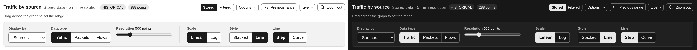
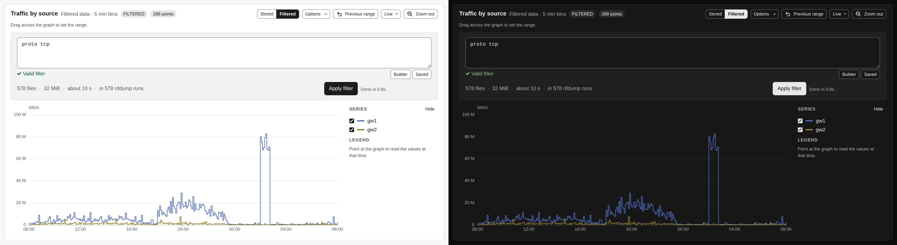
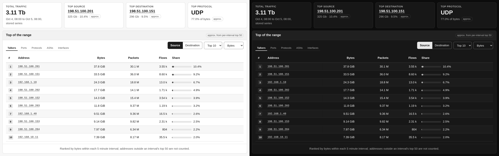

# Overview

**Overview** answers "what did the traffic look like, and who made most of it?"
for the range in the controls bar. It is the only page that shows something as
soon as it opens: the graph reads the stored series and the top lists come from
data the import already collected, so nothing waits for a query.

## Reading the graph

The title says what is plotted (*Traffic by source*, *Packets by protocol*, …),
and the line next to it which data: *Stored data · 5 min resolution* for the
series the import writes, *Filtered data* for a graph built through a filter
(see below). A **LIVE** badge with the time of the last update means the window
follows the newest data; **HISTORICAL** means it stays where it is. The last
badge counts the data points.

The panel beside the graph has two lists. **Series** has a checkbox with the
line's colour for every series, to hide the ones in the way. **Legend** shows
the values at the time you point at, largest first. **Hide** folds the panel
away. Pointing at a line lifts it and fades the rest.

The graph also sets the time range for every page: drag across it. The
[Quick Tour](quick-tour.md#the-traffic-graph) describes the zoom, preview and
Live controls in its header.

## Choosing what to plot

**Options** in the graph header opens the settings of this graph:

| Control | What it does |
|---|---|
| **Display by** | **Sources** (one line per exporter), **Protocols** (TCP, UDP, ICMP, Other) or **Ports** (one line per tracked port you pick) |
| **Data type** | **Traffic**, **Packets** or **Flows** |
| **Resolution** | How many points to draw, from 50 to 2000 |
| **Scale** | **Linear** or **Log** |
| **Style** | **Stacked** areas or single **Line**s |
| **Line** | **Step** or **Curve** |

The sources, the protocol and the unit (bits or bytes) come from the controls bar
and apply here too. The protocol there narrows the Sources and Ports displays; the
Protocols display always shows all four protocols and says so. Scale, Style and
Line only change the drawing and are remembered by this browser.

## Graphing what a filter matches

The stored series hold totals per source, protocol and port, so there is nothing
in them to narrow down by address after the fact. Switch the **Stored** and
**Filtered** toggle in the graph header to **Filtered** to plot any nfdump filter
instead: nfsen-ng then re-reads the capture files, one nfdump run per point,
several at a time.

That reads capture files, so it never runs on its own. Type the filter (the field
says whether nfdump accepts it), check the estimate next to it, and press **Apply
filter**. An empty filter graphs all traffic. The button shows progress and the
time left, and **Kill** stops the build at once, keeping the points it has.
The graph then says **FILTERED** and does not refresh itself. The **Ports**
display is not available in this mode, because the filter already is the port
selection. Narrow the range first; the window width, not the number of points,
decides how long a build takes.

To see a filter as a timeline *and* as individual records, filter on
[Flows](browsing-flows.md) and open **Traffic over time** there.

## Key figures

Four cards sit under the graph:

- **Total traffic** in the range, from the stored series, in the unit of the
  controls bar.
- **Top source** and **Top destination**, the busiest addresses with their volume
  and share of bytes. Click an address to [look it up](ip-lookup.md).
- **Top protocol** with its share of bytes.

The three top cards come from the precomputed lists described below and carry an
**approx.** badge. Instead of a figure they can say *Computing*, *Collecting*
(nothing collected yet), *Outside the 31 day window*, or *Top-N disabled*.

## Top of the range

The card under the key figures ranks the busiest keys of the range, one tab each
for **Talkers** (addresses), **Ports**, **Protocols**, **ASNs** and
**Interfaces**. Next to the tabs you choose **Source** or **Destination** (**In**
or **Out** for interfaces; protocols have no direction), **Top 10**, **20** or
**50**, and the order: **Bytes**, **Packets** or **Flows**. Each row shows bytes,
packets, flows and its share of the range's bytes. Click an address to look it up.

The lists are *approximate*, and the card says so. While importing, nfsen-ng
stores the top 50 of every statistic for each five-minute capture file, and the
card adds these up over the range. A key that never made an interval's top 50 is
not counted, so a host that is always 51st is missing. The footer of the card
repeats this rule, says when the stored intervals cover less than 95 % of the
range, and, while a protocol is selected in the controls bar, that the protocol
does not narrow these lists. The intervals are ranked by bytes, so ordering by
packets or flows is labelled *ranked by bytes per interval*. For ranges up to six
hours an **In top 50** column says in how many intervals each key made the list.

The rank numbers take a graph colour only when the row is a line in the graph
above: protocols while the graph shows the Protocols display, and ports while it
shows those ports. Everything else stays neutral.

## Ranges outside the stored lists

The lists reach back as far as the administrator configured, 31 days by default
(`NFSEN_TOPN_RETENTION_DAYS`). For a range that starts earlier, or when
collection is off, the card offers **Run exact query** instead: the same list
computed by nfdump from the capture files, with the usual estimate before you
press it. The result is labelled **Exact (nfdump)** with the command it ran, and
its share column is nfdump's own share of the bytes in the capture files it read.
Those can be fewer than the stored graph covers, because capture files are often
kept for less time than the series.

## What's next

Once you spot something on the graph, drag across it to narrow the range, then
open [Top Talkers](top-talkers.md) for exact rankings of that window,
[Flows](browsing-flows.md) for the records themselves, or
[Conversations](conversations.md) to see who talked to whom.
