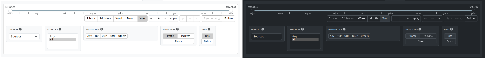

# Quick Tour

When you open nfsen-ng, you land on the **Graphs** tab — a live traffic
chart for whatever's currently being captured.

## The navigation bar

Across the top: a home/reload icon, a dark-mode toggle (moon/sun), a
reconnect spinner (only appears if your connection to the server drops —
see below), and the five tabs: **Graphs**, **Flows**, **Statistics**,
**Sankey**, and **Settings**. Whichever preset (source) you're viewing shows
in the top-left corner.

Switching tabs is instant — there's no page reload, and whatever filters you
had set on a tab are still there when you come back to it.

## The shared control bar

Every data tab (Graphs, Flows, Statistics, Sankey) shares the same date
range control at the top, plus a filter panel specific to that tab below it:

- **Date range slider** — drag either handle, or use the quick-select
  buttons (1 hour / 24 hours / Week / Month / Year) to jump to a common
  window. The **←** / **→** buttons step back/forward by the current
  window's length (e.g. clicking Week then → jumps forward exactly one
  week); **⇥** jumps to "now".
- **Custom duration** — type a number, pick h/d/w, and click **Apply** for
  anything the presets don't cover (e.g. "6 hours").
- **Sync now / Follow** — on the Graphs tab specifically, **Follow** keeps
  the window pinned to "now" as new data arrives, so the chart scrolls
  automatically.

Changing the date range or any filter on the **Graphs** tab updates the
chart immediately. **Flows**, **Statistics**, and **Sankey** are different —
querying flow records runs the real `nfdump` tool, which costs real time and
I/O, so those tabs only run a query when you click their **Process data**
button. Nothing happens automatically until you do.

## If you see a "Reconnecting…" banner

nfsen-ng pushes live updates to your browser over a persistent connection
(Server-Sent Events). If that connection drops — your laptop slept, a proxy
timed out, the server restarted — you'll see a small spinner next to the
dark-mode toggle and a banner at the top of the page. It reconnects
automatically; you don't need to reload, though a manual reload (the
home/reload icon) never hurts if it seems stuck.

## Where to go next

- [The Dashboard](dashboard.md) — reading the traffic graph
- [Browsing Flows](browsing-flows.md) — searching individual flow records
- [Setting Up Alerts](alerts.md) — get notified when traffic crosses a threshold
