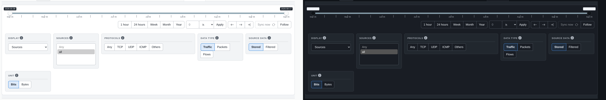
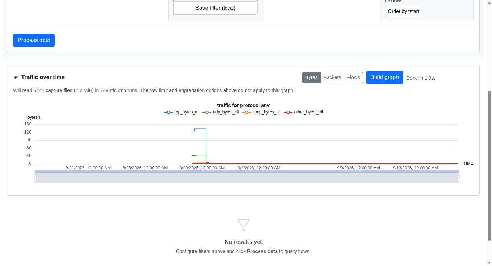

# Quick Tour

When you open nfsen-ng, you land on the **Graphs** tab — a live traffic
chart for whatever's currently being captured.

## The navigation bar

Across the top: a home/reload icon, a dark-mode toggle (moon/sun), a
reconnect spinner (only appears if your connection to the server drops —
see below), and the tabs: **Graphs**, **Flows**, **Statistics**, **Sankey**,
and **Settings**. Whichever
preset (source) you're viewing shows in the top-left corner.

Switching tabs is instant — there's no page reload, and whatever filters you
had set on a tab are still there when you come back to it.

## The shared control bar

Every data tab (Graphs, Flows, Statistics, Sankey) shares the same date
range control at the top, plus a filter panel specific to that tab below it:

- **Date range slider** — drag either handle, or use the quick-select
  buttons (1 hour / 24 hours / Week / Month / Year) to jump to a common
  window. The **←** / **→** buttons step back/forward by the current
  window's length (e.g. clicking Week then → jumps forward exactly one
  week); **⇥** jumps to "now".
- **Custom duration** — type a number, pick h/d/w, and click **Apply** for
  anything the presets don't cover (e.g. "6 hours").
- **Sync now / Follow** — on the Graphs tab specifically, **Follow** keeps
  the window pinned to "now" as new data arrives, so the chart scrolls
  automatically.

Changing the date range or any filter on the **Graphs** tab updates the
chart immediately. **Flows**, **Statistics**, and **Sankey** are different —
querying flow records runs the real `nfdump` tool, which costs real time and
I/O, so those tabs only run a query when you click their **Process data**
button. Nothing happens automatically until you do.

While a query runs, the button itself tells you how far along it is, with an
ETA and a **Kill** button for the times you asked for more than you meant to:

## Seeing when your flows happened

Once you have filtered in **Flows**, expand **Traffic over time** above the
results to plot that same filter:

It answers "when did this happen" without describing the query twice. The graph
plots the filter you already typed, including the min and max byte limits, so
it shows exactly the traffic the table lists.

Two caveats it states on screen. The row limit and the aggregation options do
not apply to it, because they truncate and regroup the table rather than change
which records match — so a table of 100 rows can sit beside a graph of every
matching byte. And plotting a filter means reading capture files, one nfdump run
per interval, so it never builds on its own: the panel tells you what it will
read and waits for you to press **Build graph**.

If the query or the window moves after a build, the panel says so and keeps
showing what it built, rather than throwing away a graph you waited for.

## If you see a "Reconnecting…" banner

nfsen-ng pushes live updates to your browser over a persistent connection
(Server-Sent Events). If that connection drops — your laptop slept, a proxy
timed out, the server restarted — you'll see a small spinner next to the
dark-mode toggle and a banner at the top of the page. It reconnects
automatically; you don't need to reload, though a manual reload (the
home/reload icon) never hurts if it seems stuck.

## Where to go next

- [The Dashboard](dashboard.md) — reading the traffic graph, and
  [graphing only what a filter matches](dashboard.md#asking-a-narrower-question)
- [Browsing Flows](browsing-flows.md) — searching individual flow records
- [Setting Up Alerts](alerts.md) — get notified when traffic crosses a threshold
