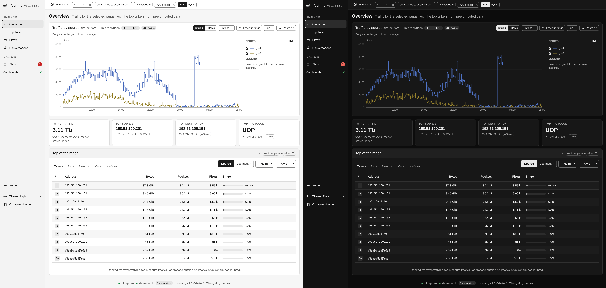
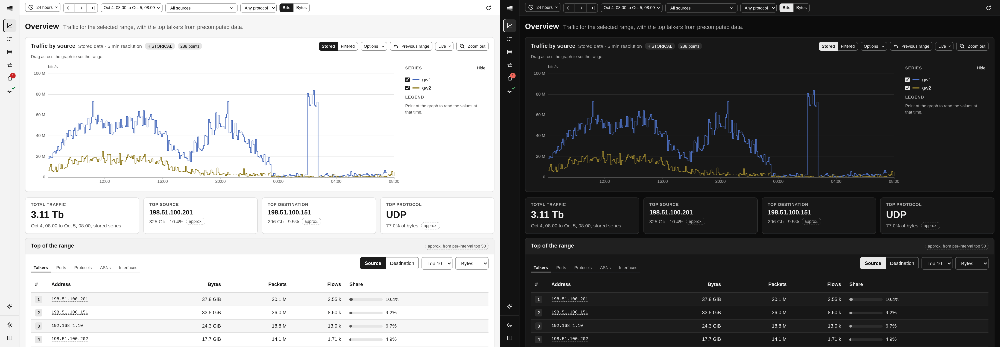
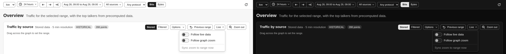
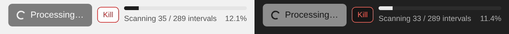
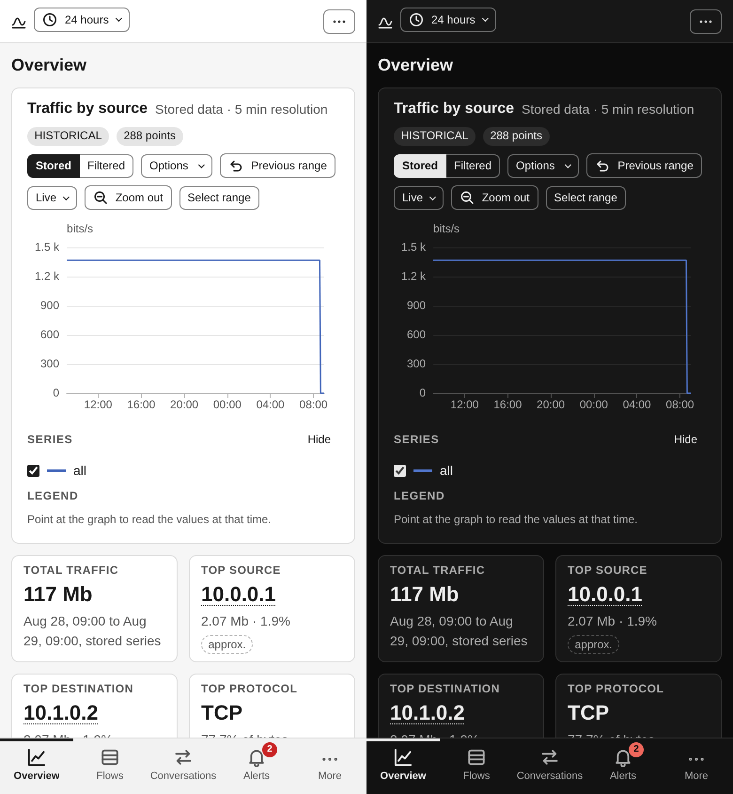

# Quick Tour

nfsen-ng opens on **Overview**: the traffic graph for the last 24 hours, four key
figures, and the busiest addresses, ports and protocols of that range. An
administrator can pick a different start page and range under
[Settings](settings.md).

## The sidebar

The sidebar on the left lists the pages in two groups. **Analysis** holds
**Overview**, **Top Talkers**, **Flows** and **Conversations**, the four pages
that read traffic; **Monitor** holds **Alerts** and **Health**. **Settings**
sits at the bottom.

A few pages carry a status next to their name. Alerts shows a count while rules
are firing, Health shows a dot coloured by the worst check result, and an import
icon appears beside Health while an import runs. Each of them also says in words
what it shows when you point at it.

Below the pages are the theme menu (**Light**, **Dark**, **System**, or **Use
instance default**, which follows the choice in Settings) and **Collapse
sidebar**, which shrinks the sidebar to its icons. Both are remembered by this
browser only.

Every page has its own address, such as `#/flows` or `#/alerts`, so you can
bookmark a page, open it in a new tab with a middle click, and use the browser's
back button between pages. Switching pages is instant, and what you entered on a
page is still there when you come back to it.

## The controls bar

The bar at the top sets the time range and the scope for every page at once:

- **Profile**, at the start of the bar, appears only when there is more than one
  nfdump profile (see [nfdump Profiles](../deployment/profiles.md)).
- **The range menu** (clock icon) names the current window. It offers the
  presets **Last 1 hour**, **Last 24 hours**, **Last 7 days**, **Last 30 days**
  and **Last year**, and a **Custom duration**: a number of hours, days or
  weeks, then **Apply**.
- **Previous period** and **Next period** step the window back or forward by its
  own width; **Jump to now** moves it to end now. Previous period is disabled at
  the start of the stored data.
- **The start and end** of the window are shown next to the step buttons, in the
  timezone Settings asks for. Click them to type an exact **From** and **To**.
- **Sources** picks which exporters count, as *All sources* or *2 of 5 sources*. A source can carry a name to show (`NFSEN_SOURCES=10-20-100-3:dc1rt310`).
  At least one stays checked.
- **Protocol** narrows everything to **TCP**, **UDP**, **ICMP** or **Other**, or
  leaves it at **Any protocol**.
- **Bits** or **Bytes** sets the unit for rates and volumes in the graphs and key
  figures. Result tables always count bytes.

At the end of the bar, a chip appears while an import runs (**Import running**
with its progress and time left, **Import behind** when more than a dozen files
are waiting, **Import failed** after a failed pass); it links to the Health page.
A spinner appears there when the connection to the server drops (see below), and
the last button reloads the page.

### Live and historical windows

A preset, a custom duration and **Jump to now** make the window *live*: it keeps
ending now, and the graph says **LIVE** with the time of its last update. Stepping
back, or choosing a window that ends in the past, pins it, and the graph says
**HISTORICAL**. **Next period** back up to now makes it live again.

## The traffic graph

Overview, Top Talkers, Flows and Conversations show the traffic graph above the
page. It reads the stored series, so it costs nothing and updates on its own.
While the window is live it refreshes every 15 seconds on Overview and every
minute on the other three pages, and every open page redraws it after each
import.

What it plots depends on the page. Overview shows its own configuration (by
source, protocol or port, see [Overview](overview.md)); Top Talkers and Flows
show **Traffic by protocol**; Conversations shows one **Total traffic** line. The
line under the title says which data it is, e.g. *Stored data · 5 min
resolution*.

**The graph sets the range.** Drag across it to make the dragged span the window
of every page. The header has the other range tools:

- **Previous range** goes back to the window before your last change.
- **Zoom out** shows twice the time around the current window.
- **Ctrl + mouse wheel** zooms the graph without changing the range. The header
  then says *Previewing* and the zoomed span, with **Apply** (make it the range)
  and **Reset**. A plain mouse wheel scrolls the page.
- **Live** opens a menu with **Follow live data** (the same as live above),
  **Follow graph zoom** (apply every zoom at once instead of previewing it) and
  **Sync zoom to range now**.
- **Select range**, on a touch screen, arms the graph for one drag, since a swipe
  there scrolls the page.

## Running queries

Everything that reads nfcapd capture files costs real time and disk I/O, so it
never starts on its own. The pages that do it (Top Talkers, Flows, Conversations,
and Overview's filtered graph and exact run) show an **estimate** first: how many
capture files the query would read, how large they are, and about how long that
takes. The time comes from a default read rate until this server has recorded a
few runs of the same kind, then from their median. **Large query** marks a query
over 16 GiB, and *last 7 days only* means the administrator capped the window
with `NFSEN_MAX_STATS_WINDOW`.

Press **Run** (or **Apply filter** on the graph, **Build graph** for a Flows
timeline) to start. The button shows how far along it is with a progress bar and
the time left, and **Kill** stops it:

A result stays until you run again. When you change the filter, the range or any
option afterwards, the result says *These results are for an earlier query. Run
again to update.* When a live window has moved on by more than five minutes, it
says which span it covers instead.

## Filters

Every nfdump filter field checks what you type against nfdump itself, a moment
after you stop typing, and says **Valid filter** or shows nfdump's error. Its
**Builder** and **Saved** buttons open the [filter builder](filter-builder.md),
with a field reference, examples and your saved filters.

## The footer

The footer shows whether nfcapd is delivering (**nfcapd ok**, **stale** or **no
data**), the state of the import daemon (**ok**, **starting** or **disabled**),
how many browser connections the server has, the version, and links to the
changelog and the issue tracker.

## If you see a reconnecting spinner

nfsen-ng pushes live updates to your browser over a persistent connection
(Server-Sent Events). If that connection drops (your laptop slept, a proxy timed
out, the server restarted), a spinner appears at the end of the controls bar,
next to the reload button. It reconnects automatically; you don't need to
reload, though the reload button never hurts if it seems stuck.

## On a phone

Below 768 pixels wide, the sidebar becomes a tab bar at the bottom with
**Overview**, **Flows**, **Conversations**, **Alerts** and **More**. More holds
Top Talkers, Health, Settings and the theme choice, and is marked while one of
its pages is open. The graph comes first, the page follows in one column, the
controls bar keeps the range menu and folds the rest behind **More controls**,
and each query form folds behind **Show filters**.

## Where to go next

- [Overview](overview.md): reading the traffic graph and the top lists, and
  [graphing only what a filter matches](overview.md#graphing-what-a-filter-matches)
- [Flows](browsing-flows.md): searching individual flow records
- [Setting Up Alerts](alerts.md): get notified when traffic crosses a threshold
