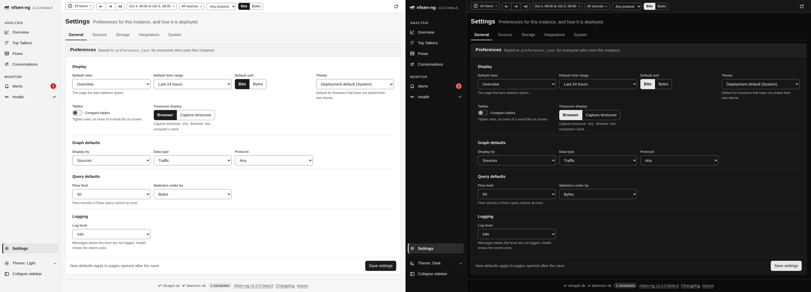
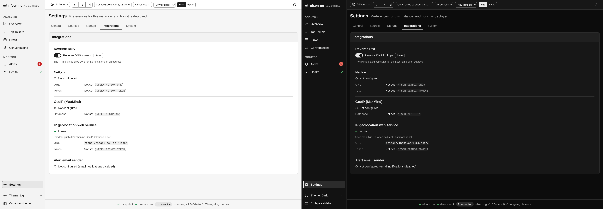
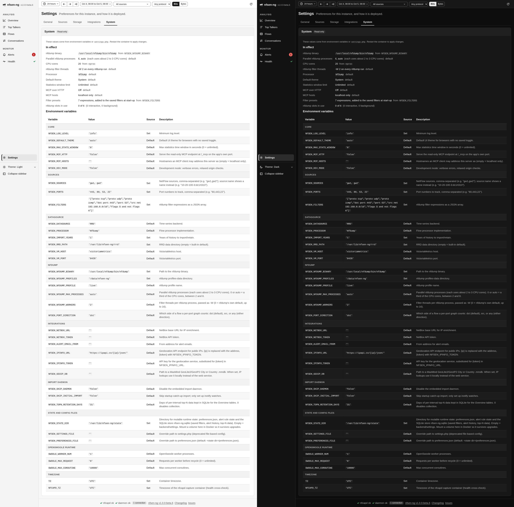

# Settings

**Settings** has five tabs. **General** holds the preferences you can change from
the browser; **Sources**, **Storage**, **Integrations** and **System** show how
this instance is deployed, and apart from one switch they are read-only.

## General

These preferences are saved to `preferences.json` on the server, so they apply to
everyone who uses this instance, in every browser. **Save settings** at the bottom
saves the whole tab.

**Display**

- **Default view**: the page that opens when the address has none.
- **Default time range**: the range a new tab starts with, from **Last hour** to
  **Last year**.
- **Default unit**: **Bits** or **Bytes** for rates and volumes.
- **Theme**: the theme for browsers that have not picked their own in the
  sidebar. **Deployment default** uses what the administrator set
  (`NFSEN_DEFAULT_THEME`, named in brackets); **System** follows each computer's
  light or dark setting; **Light** and **Dark** force one.
- **Compact tables**: tighter rows, so more of a result fits on screen.
- **Timezone display**: show times in each **Browser**'s timezone, or in the
  **Capture timezone** nfcapd names its files in. Handy if you monitor a network
  in another timezone than the one you are sitting in.

**Graph defaults** set what the Overview graph starts with: **Display by**,
**Data type**, and the **Protocol** the controls bar starts with.

**Query defaults** set the **Flow limit** for [Flows](browsing-flows.md) and the
**Statistics order by** for [Top Talkers](top-talkers.md).

**Logging** sets the **Log level** of the server. Leave it at the default unless
you're troubleshooting; the [Health](health.md) page shows the recent lines. A
saved log level overrides `NFSEN_LOG_LEVEL`.

Saved filters are managed in the [filter builder](filter-builder.md), not here.

### Which theme you see

A browser's own choice in the sidebar theme menu wins. Without one, the
**Theme** above applies, and while that is left at *Deployment default*,
`NFSEN_DEFAULT_THEME` does. **Use instance default** in the theme menu drops the
browser's own choice again.

## Sources and Storage

**Sources** lists the configured sources and ports, the port direction, the
capture directory root, the default and the detected profiles, and every capture
directory with its state.

**Storage** shows the datasource and where it keeps its data, the import depth,
the state directory, the preferences and settings files, the top-N retention,
and the SQLite store: its file, size, journal mode and schema version, or the
problem that keeps it from working.

Both come from environment variables or `settings.php` and change only with a
restart; see [Configuration](../deployment/configuration.md).

## Integrations

- **Reverse DNS**: whether the [IP info dialog](ip-lookup.md) asks DNS for the
  host name of an address. This is the one switch on these tabs; **Save** next to
  it stores it.
- **Netbox**: whether a Netbox instance is configured for private addresses, with
  its URL and the token masked.
- **GeoIP (MaxMind)**: the local geolocation database, if one is set, with its
  type and build date and whether IP lookups use it, or the reason they can't.
- **IP geolocation web service**: the service used for public addresses when no
  GeoIP database answers, with its URL and the token masked.
- **Alert email sender**: the From address alert emails use, or *Not configured*,
  which means email notifications are off.

## System

**System** shows what the instance runs with. **In effect** lists the values the
app uses, each marked as a default or with where it came from. **Environment
variables** lists every variable nfsen-ng reads, grouped, with its value, whether
it was set or defaulted, and what it does; tokens are masked. If a `settings.php`
is loaded, the tab says so, because its values win over the variables.

You (or whoever you ask for help) can see this way exactly what an instance is
configured with, without shell access to the host.
