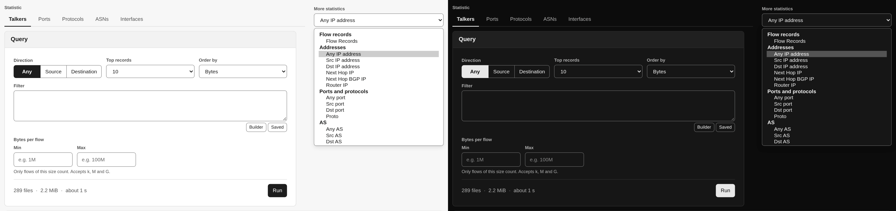

# Top Talkers

**Top Talkers** answers "who are the top N?": the busiest hosts, ports,
protocols, autonomous systems or interfaces of the range, ranked and totalled,
exactly as nfdump counts them. [Overview](overview.md) shows similar lists at no
cost, but they are approximate and reach back only a month; this page reads the
capture files and is exact for any range they cover.

## Choosing a statistic

The **Statistic** row picks the common ones: **Talkers** (IP addresses),
**Ports**, **Protocols**, **ASNs** and **Interfaces**. **Direction** in the query
card decides which side counts: **Any**, **Source** or **Destination** (for
interfaces: in or out; protocols have no direction). *Talkers* with *Destination*
is nfdump's `dstip` statistic, *Ports* with *Any* is `port`, and so on.

**More statistics** lists every statistic nfdump offers, 58 in all, in groups:
flow records, addresses (including next hop and router), ports and protocols,
AS, interfaces, ToS, masks, VLAN, MAC, MPLS, NSEL (Cisco ASA) and NEL (NAT).
Statistics that the installed nfdump cannot compute are shown but disabled,
marked *not supported by this nfdump*, with nfdump's reason in the tooltip. The
nfdump 1.7.10 in the Docker image, for example, rejects the five NEL statistics.

Choosing a statistic never runs a query. It shows the estimate for the new
statistic, and if you ran that statistic before in this tab, its last result
comes back.

## Running a query

| Control | What it does |
|---|---|
| **Top records** | How many rows to return: 10, 20, 50, 100, 200 or 500 |
| **Order by** | Rank by **Flows**, **Packets**, **Bytes**, **Packets per second**, **Bits per second** or **Bytes per packet** |
| **Filter** | Any nfdump filter, checked as you type; **Builder** and **Saved** open the [filter builder](filter-builder.md) |
| **Bytes per flow** | Only flows between **Min** and **Max** bytes count (accepts `k`, `M` and `G`) |
| **Aggregation** | For **Flow Records** only, see below |

The range, the sources and the protocol come from the controls bar. Check the
estimate, then press **Run**. The result card is titled with what it ranks
(*Dst IP address, ordered by bytes*) and shows the exact nfdump command it ran,
with a **Copy** button and the time it took.

A large query runs faster on a server with several nfdump processes: nfsen-ng
splits a read of more than a second over at least 12 capture files into time
slices, runs one nfdump per slice at the same time and merges them into exactly
the rows a single run prints. The progress then counts files (*Read 120 of 288
files in 4 nfdump processes*), and the status says *Done in 3.1s with 4 nfdump
processes.* Rankings by a rate (packets or bits per second, bytes per packet)
and **Bi-directional** always run as one process.

The table sorts by any column, and **Columns** hides the ones you don't need
(remembered by this browser). **Export** saves the rows as CSV or JSON or prints
them; with **Enhanced data** on, the export has the formatted values as shown,
otherwise the raw numbers. Click an IP address to [look it up](ip-lookup.md).

Warnings that belong to a result stay with it: a window shortened by
`NFSEN_MAX_STATS_WINDOW`, or what nfdump printed on its error output, such as a
truncated capture file. A run you **Kill** keeps the previous result of that
statistic.

## Protocol share and top ASNs

Two cards beside the query answer the questions that usually come next, each
with its own **Run** and the size of what it will read:

- **Protocol share** splits the bytes of the query into TCP, UDP, ICMP and the
  rest, as bars in the graph's protocol colours. With a protocol chosen in the
  controls bar the answer is trivial, and the card says so.
- **Top ASNs** lists the busiest autonomous systems. Its share counts each flow
  half for its source AS and half for its destination AS; point at a bar for
  nfdump's byte count of that AS.

Both use the filter, byte limits, range, sources and protocol of the query card.
When those change after a run, the card says its result is for an earlier query.

## Aggregating flow records

**Flow Records** ranks whole flows rather than one element of them, so what
counts as *one* flow is a question only you can answer: every distinct 5-tuple,
everything to the same port, or everything between two /24s. The
**Aggregation** controls answer it, and they are the same ones the
[Flows](browsing-flows.md) page uses: bidirectional, protocol, source and
destination port, and per-direction IP with an optional prefix length.

They appear for **Flow Records** only, because nfdump applies an aggregation to
that statistic alone. The columns change with the aggregation: aggregating by
destination port yields a table of ports, because the fields you did not
aggregate on no longer identify a row.

**Bi-directional** merges both directions of a conversation into one row: the
request and its answer become one flow record with **In** and **Out** counters
and **Flows** 2. It is the one query whose output format nfdump chooses for
itself: it prints its merged-flow table as fixed-width text whatever `-o` it is
given. nfsen-ng reads that table back into columns, so it behaves like any other
result, with nfdump's text one click away under **Original**. It needs nfdump
1.7.10: a gcc build of 1.7.8 or 1.7.9 lists the two directions as separate rows
with an empty Out side, and the Health page warns about it.

