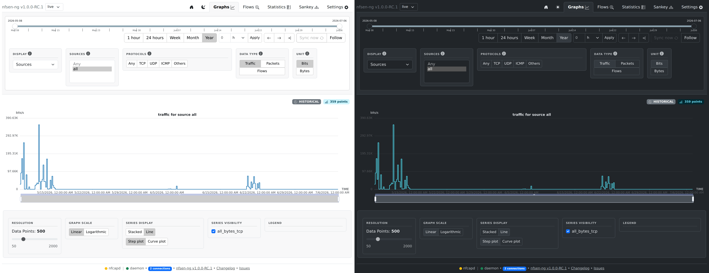

# Introduction

nfsen-ng is a modern, in-place replacement for the ageing [NfSen](http://nfsen.sourceforge.net/)
web frontend. It sits on top of the existing [nfdump](https://github.com/phaag/nfdump)
tool suite and adds real-time SSE push, a responsive UI, and a choice of RRD or
VictoriaMetrics as the storage backend — without changing how nfcapd itself
captures traffic.

## Who this is for

Anyone already running (or migrating from) NfSen/nfdump to monitor NetFlow
traffic: source/destination breakdowns, protocol and port distributions, flow
search, and threshold alerting, all served from the nfcapd files nfdump
already writes.

## The shape of the app

nfsen-ng is a single-page application: one route (`/`) serves the whole UI,
and every "page" the nav bar shows — Graphs, Flows, Statistics, Sankey,
Settings — is a client-local view switch, not a server round-trip. The
server side is PHP 8.4 running on [OpenSwoole](https://openswoole.com/)
coroutines via a small in-house framework ([php-via](https://github.com/mbolli/php-via)),
pushing UI updates to the browser over Server-Sent Events using
[Datastar](https://data-star.dev/). There's no separate REST API and no
client-side framework build step: the server renders Twig templates, and
Datastar patches the DOM.

The [Architecture](architecture/overview.md) chapter covers how these pieces
fit together; [Features](features/graphs.md) walks each screen; and
[Development](development/getting-started.md) covers running it locally.

## Status

This book documents the `v1.0.0-RC.1` line — see the [Roadmap](roadmap.md)
for what's tracked and what's next.
